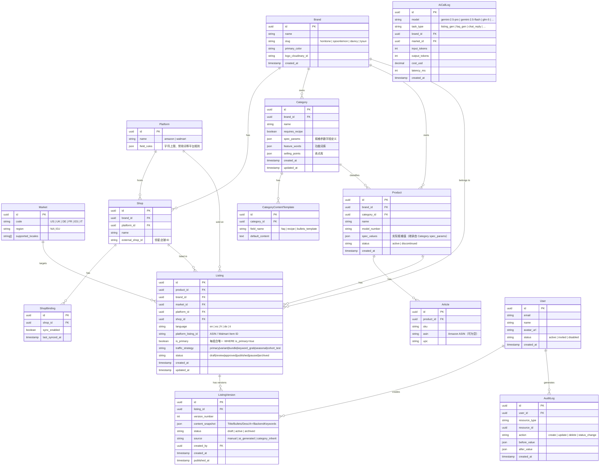
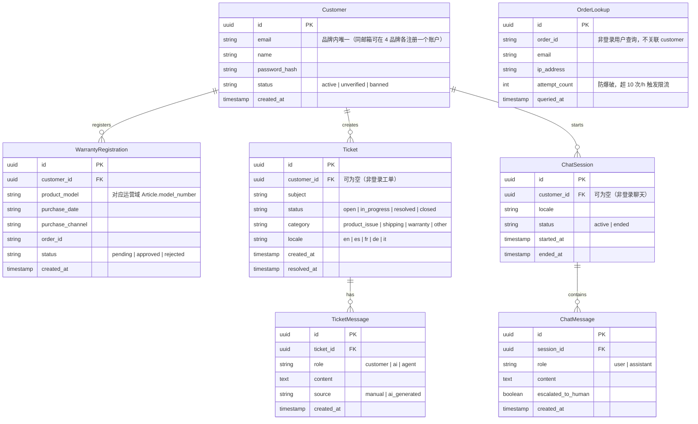

# yaemartOS 领域模型 ERD

> 版本：v1.0（对应实施方案 W2）  
> 最后更新：2026-04-30  
> 关联：`docs/adr/ADR-001-tech-stack.md` §2.3、实施方案 §6 W2

---

## Schema 边界

```
PostgreSQL (Neon)
├── public              ← 运营域（内部系统数据，38 名运营人员）
└── homtone             ← 客户域 tenant schema（Homtone 品牌客户数据）
    spoonlemon          ← 客户域 tenant schema
    davivy              ← 客户域 tenant schema
    tysun               ← 客户域 tenant schema
```

**关键隔离原则**：运营域与客户域 schema 之间无外键关联。客户域查询必须强制带 schema 前缀过滤，禁止跨 tenant 访问。

---

## 运营域（public schema）



---

## 双重唯一约束（Listing 表）

```sql
-- 约束 1：平台 listing ID 全局唯一（同一店铺内 ASIN 不重复）
UNIQUE (platform_id, shop_id, platform_listing_id)

-- 约束 2：每个【产品×品牌×市场×平台×店铺×语言】组合只能有一条 primary listing
CREATE UNIQUE INDEX uq_listing_primary
  ON listing (product_id, brand_id, market_id, platform_id, shop_id, language)
  WHERE is_primary = true;
```

同一产品在同一组合下可以有多条 listing（不同 ASIN/变体），但只有一条可以是 primary。

---

## 客户域（各 tenant schema，结构相同）



---

## product_content.source 枚举与状态机

| source 值          | 含义                    | 何时出现              |
| ------------------ | ----------------------- | --------------------- |
| `manual`           | 运营人工填写            | 直接在编辑器输入      |
| `ai_generated`     | AI 生成（Gemini/GLM-5） | 点击"AI 生成"并确认后 |
| `category_inherit` | 继承品类模板默认值      | 新建产品时自动继承    |

**AI 写入规则**（审计 P0-5）：AI 只能写入 `ListingVersion.status = 'draft'`，用户手动点击"激活"后才变为 `active`。`active` 版本不可被 AI 直接覆盖。

---

## 关键设计决策说明

| 决策                | 内容                                   | 理由                                                       |
| ------------------- | -------------------------------------- | ---------------------------------------------------------- |
| 4 tenant schema     | 客户域用 4 个独立 PostgreSQL schema    | M-13 要求跨品牌 0 数据泄漏；同邮箱可在 4 品牌各独立注册    |
| ListingVersion 子表 | 每次内容修改新建 version 行，不 UPDATE | 支持版本对比、回退、审计，符合 AI 协作的 draft/active 隔离 |
| Listing 双重约束    | 两个 UNIQUE 约束而非一个               | 允许同产品多 ASIN（变体），同时保证组合内主 listing 唯一   |
| AuditLog 独立表     | 所有写操作记录 before/after            | M-10 审计覆盖率 100%；不影响业务表查询性能                 |
| AiCallLog 独立表    | S2 起记录每次 AI 调用成本              | 按品牌/任务维度做月度成本报表                              |
