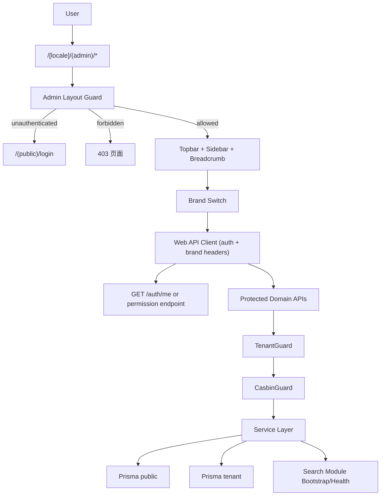
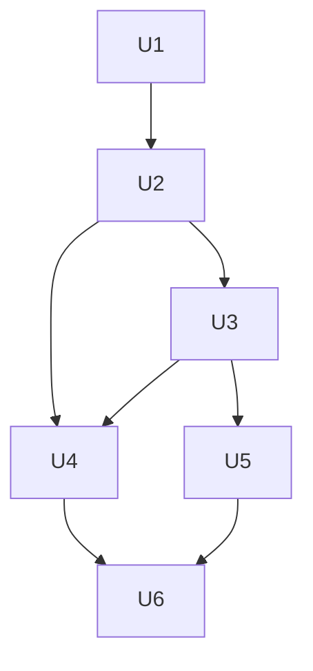

# feat: W4 admin shell + IAM 联调 + ES 初始化

## Overview

在 W2/W3 已完成多租户与 IAM 基础的前提下，交付 W4 所需的前端后台壳层、路由权限守卫、前后端 IAM 联调链路，以及 Elasticsearch 初始化与健康接入。目标是把“能登录 + 能判权 + 能隔离品牌 + 能验证搜索底座”打通为单条可复现流程，避免后续 W5/W6 继续在权限与基础设施上返工。

---

## Problem Frame

当前仓库有后端 `auth/tenant/casbin` 基础与前端 dev-preview 组件，但缺少生产级 `(admin)` 路由分组、真实权限守卫、前后端权限契约，以及 ES 初始化模块。若直接推进后续业务页面，会出现“前端隐藏但后端未拒绝”“品牌切换后数据不一致”“搜索底座未就绪”等系统性风险。

(see origin: `docs/brainstorms/pre-implementation-readiness-requirements.md`, `docs/yaemartOS-implementation-plan.md`, `docs/ui/B-admin-shell.md`)

---

## Requirements Trace

- R1. 管理后台 Shell 落地：实现 `(admin)` 路由壳层、导航、403 页面与品牌主题一致性。
- R2. 前后端 IAM 联调闭环：认证、路由守卫、API 鉴权结果一致。
- R3. 品牌/租户上下文一致：前端 brand 切换、请求头、后端 tenant 解析保持同一语义。
- R4. ES 初始化可复现：提供最小可用 index bootstrap + health 能见度。
- R5. CI/E2E 验证完整：PR 流程可稳定复跑关键守卫与联调链路。

**Origin actors:** A1 (tech lead), A2 (dev #2), A3 (运营 PM)
**Origin acceptance examples:** AE4 (W4 前 Shell/UI 规范可支撑开发与验收)

**Trace matrix:** R1 -> U1; R2 -> U2+U3; R3 -> U4; R4 -> U5; R5 -> U6

---

## Scope Boundaries

- 不在本计划实现完整业务页面（产品中心、listing 复杂编辑器）；只交付 Shell 与守卫骨架。
- 不在本计划实现 OAuth 风控/企业 SSO（SAML/SCIM）。
- 不在本计划实现 ES 全量索引策略与召回优化，仅做 W4 初始化与健康可观测。

### Deferred to Follow-Up Work

- Casbin 策略后台管理 UI：后续独立 PR。
- ES relevance tuning、召回评测自动化：后续搜索专项。

---

## Context & Research

### Relevant Code and Patterns

- 前端品牌主题与 `data-brand`：`apps/web/providers/brand-provider.tsx`, `apps/web/app/globals.css`
- 现有 dev shell 组件：`apps/web/components/dev/admin-shell-preview.tsx`
- 后端租户/IAM 基础：`apps/api/src/common/tenant/*`, `apps/api/src/auth/*`, `apps/api/src/iam/*`
- CI/Preview 基线：`.github/workflows/ci.yml`, `.github/workflows/preview.yml`

### Institutional Learnings

- `docs/solutions/design-patterns/multi-brand-dev-preview-dock-2026-04-30.md`：多品牌切换应保持单入口与统一上下文，不拆多页面并行。
- `docs/solutions/backend-patterns/nestjs-prisma-neon-multitenant-2026-04-30.md`：tenant 上下文必须与鉴权链路协同，CI 中需覆盖多 schema 迁移。

### External References

- 本轮不新增外部调研，优先遵循仓内既有模式与 ADR。

---

## Key Technical Decisions

- 前端采用 `app/[locale]/(admin)` 分组 + server layout 守卫，而非仅 middleware 判权：便于 SSR 场景拿到用户与权限上下文。
- 导航权限采用“后端返回可见能力集合”驱动，避免前端硬编码权限矩阵漂移。
- 品牌切换统一通过前端 brand context 写入请求头 `x-yaemart-brand`，后端不再依赖模糊回退语义处理关键路径。
- ES 初始化采用独立 `search` 模块（bootstrap + health），不散落在业务模块中。
- W4 验收以 e2e 场景为主（登录/403/brand 切换/API deny/ES health），单测作为补充。

---

## Open Questions

### Resolved During Planning

- W4 主线采用“先权限链路后页面扩展”的顺序，避免 UI 先行导致权限返工。
- `(admin)` 守卫出现拒绝时统一渲染 403 页面并保留 URL，便于排查。
- W4 权限能力接口采用扁平 capability 列表作为最小契约，资源树形态延后到后续版本演进。
- 错误码口径固定：未认证 `401`、已认证但无权限 `403`、brand/tenant header 非法 `400`。

### Deferred to Implementation

- ES index 的最终字段集合与 analyzer 细节在 W4 先交最小集合，完整字段由后续业务模块补齐。

---

## High-Level Technical Design

> _This illustrates the intended approach and is directional guidance for review, not implementation specification. The implementing agent should treat it as context, not code to reproduce._

术语边界：

- `brand`：前端业务视角品牌（Homtone/Spoonlemon/Davivy/Tysun）。
- `tenant`：后端请求上下文中的租户标识，当前与 brand 一一对应。
- `tenant schema`：PostgreSQL schema 层面的数据隔离单元（由 tenant 解析后命中）。

---

## Implementation Units

- [ ] U1. **建立 W4 前端路由骨架与 Admin Shell**

**Goal:** 落地 `(admin)` 路由组、壳层布局、403 页面与品牌主题接入。

**Requirements:** R1

**Dependencies:** None

**Files:**

- Create: `apps/web/app/[locale]/(admin)/layout.tsx`
- Create: `apps/web/app/[locale]/(admin)/dashboard/page.tsx`
- Create: `apps/web/app/[locale]/(admin)/forbidden/page.tsx`
- Create: `apps/web/components/admin/admin-shell.tsx`
- Create: `apps/web/components/admin/admin-sidebar.tsx`
- Create: `apps/web/components/admin/admin-topbar.tsx`
- Modify: `apps/web/app/[locale]/layout.tsx`
- Test: `apps/web/components/admin/admin-shell.spec.tsx`

**Approach:**

- 从现有 `dev` 组件提炼可复用壳层，迁移到正式 `(admin)` 路由分组。
- Shell 视觉与交互遵循 `docs/ui/B-admin-shell.md`，品牌色继续通过 `data-brand` 变量驱动。

**Patterns to follow:**

- `apps/web/providers/brand-provider.tsx`
- `apps/web/components/dev/admin-shell-preview.tsx`

**Test scenarios:**

- Happy path: 已登录用户访问 admin dashboard，正确渲染 topbar/sidebar/breadcrumb。
- Edge case: 品牌切换后 root 节点 `data-brand` 变化且主区域色彩即时更新。
- Error path: 进入 forbidden 路由渲染 403 页面，不发生死循环跳转。
- Integration: `app/[locale]/layout` 与 `(admin)` layout 叠加后，i18n/provider 仍正常工作。

**Verification:**

- `(admin)` 路由可独立访问，Shell 结构完整并支持品牌切换。

---

- [ ] U2. **前端认证会话与路由守卫闭环**

**Goal:** 实现登录态校验、未登录跳转、token 刷新与失败降级。

**Requirements:** R2

**Dependencies:** U1

**Files:**

- Modify: `apps/api/src/auth/auth.controller.ts`
- Modify: `apps/api/src/auth/strategies/jwt.strategy.ts`
- Create: `apps/web/lib/api/auth-client.ts`
- Create: `apps/web/lib/auth/session.ts`
- Create: `apps/web/lib/auth/route-guard.ts`
- Create: `apps/web/app/[locale]/(public)/login/page.tsx`
- Modify: `apps/web/app/[locale]/(admin)/layout.tsx`
- Test: `apps/web/lib/auth/route-guard.spec.ts`
- Test: `tests/e2e/w4-auth-admin.spec.ts`

**Approach:**

- 先固定会话传输契约（W4 采用 Bearer token + refresh token），并与后端 auth 提取逻辑保持一致。
- 在 server layout 入口完成会话判定；未登录转登录页，授权不足走 403。
- 会话刷新采用“失败即回登录”的显式状态机，不在页面层隐式吞错。

**Patterns to follow:**

- `apps/api/src/auth/auth.controller.ts`（登录/刷新/me 契约）

**Test scenarios:**

- Happy path: 有效 session 可进入 `(admin)` 页面并加载用户信息。
- Edge case: access token 过期且 refresh 成功，请求恢复并继续渲染页面。
- Error path: refresh 失败时清理会话并跳转登录页。
- Integration: 页面守卫与 API 401/403 响应处理一致，不出现前端假放行。

**Verification:**

- 登录与守卫链路可复现，401/403 分流行为稳定。

---

- [ ] U3. **IAM 可见能力契约与菜单/路由裁剪**

**Goal:** 打通前后端权限契约，基于真实权限渲染导航与路由访问控制。

**Requirements:** R2

**Dependencies:** U2

**Files:**

- Create: `apps/api/src/iam/iam.controller.ts`
- Modify: `apps/api/src/iam/casbin.module.ts`
- Modify: `apps/api/src/iam/casbin.service.ts`
- Create: `apps/web/lib/auth/permissions.ts`
- Modify: `apps/web/components/admin/admin-sidebar.tsx`
- Test: `apps/api/src/iam/casbin.guard.spec.ts`
- Test: `apps/web/lib/auth/permissions.spec.ts`
- Test: `tests/e2e/w4-permission-guard.spec.ts`

**Approach:**

- 提供前端可消费的“当前用户能力”接口（最小必要能力集）。
- 前端根据能力集合裁剪菜单；URL 直达仍需后端 guard 二次拒绝。

**Patterns to follow:**

- `apps/api/src/iam/require-policy.decorator.ts`
- `apps/api/src/iam/casbin.guard.ts`

**Test scenarios:**

- Happy path: 具备权限用户可见并可访问对应路由与 API。
- Edge case: 同一用户在不同 market/shop 维度下权限结果不同且可验证。
- Error path: 无权限访问返回 403，菜单项不渲染。
- Integration: 前端菜单可见性与后端 Casbin 判定一致。

**Verification:**

- 权限来源由后端统一输出，前后端判权结果不冲突。

---

- [ ] U4. **品牌/租户上下文一致性与请求头规范化**

**Goal:** 保证 brand 切换与后端 tenant 解析一致，避免默认回退导致串上下文。

**Requirements:** R3

**Dependencies:** U2, U3

**Files:**

- Modify: `apps/web/lib/api/auth-client.ts`
- Modify: `apps/web/providers/brand-provider.tsx`
- Modify: `apps/api/src/common/tenant/tenant.guard.ts`
- Modify: `apps/api/src/iam/casbin.guard.ts`
- Test: `apps/api/src/common/tenant/tenant.guard.spec.ts`
- Test: `tests/e2e/w4-brand-switch.spec.ts`

**Approach:**

- 前端统一发送 `x-yaemart-brand`；后端在受保护路由上启用 strict 策略，对缺失/非法 header 明确失败。
- 将授权 brand 与 tenant 解析结果纳入同一验证链路，避免“授权与数据路由分离”。

**Patterns to follow:**

- `apps/api/src/common/tenant/tenant.constants.ts`
- `apps/api/src/common/tenant/tenant-context.service.ts`

**Test scenarios:**

- Happy path: brand 切换后请求命中对应 tenant schema 并返回正确品牌数据。
- Edge case: 连续快速切换 brand，最终页面与数据均收敛到最后一次选择。
- Error path: 非法 brand header 返回明确 4xx。
- Integration: brand context -> request header -> tenant client 的链路全程一致。

**Verification:**

- 无串租户现象，非法 brand 输入可诊断且可测试。

---

- [ ] U5. **ES 初始化模块与健康检查接入**

**Goal:** 提供 W4 可用的 ES bootstrap 与 health，支撑后续搜索功能迭代。

**Requirements:** R4

**Dependencies:** U3

**Files:**

- Modify: `apps/api/package.json`
- Modify: `docker-compose.yml`
- Modify: `.github/workflows/ci.yml`
- Create: `apps/api/src/search/search.module.ts`
- Create: `apps/api/src/search/search.service.ts`
- Create: `apps/api/src/search/search.controller.ts`
- Modify: `apps/api/src/health/health.controller.ts`
- Modify: `apps/api/src/app.module.ts`
- Test: `apps/api/src/search/search.service.spec.ts`
- Test: `tests/e2e/w4-es-health.spec.ts`

**Approach:**

- 将 ES 初始化与健康逻辑封装为独立模块，提供幂等 bootstrap 入口。
- 增加本地/CI 的 ES 基础设施前置配置，保证 bootstrap 与 e2e 可执行。
- health 汇总中增加 search 子状态，不影响已有 db/tenant 健康检查。

**Patterns to follow:**

- `apps/api/src/health/health.controller.ts`

**Test scenarios:**

- Happy path: bootstrap 成功创建/更新 index 并返回健康状态 up。
- Edge case: 重复执行 bootstrap 无副作用（幂等）。
- Error path: ES 不可达时返回 degraded 并包含诊断信息。
- Integration: health endpoint 同时暴露 db 与 search 状态，便于 CI/E2E 断言。

**Verification:**

- ES 初始化可重复执行，health 能反映真实连通性。

---

- [ ] U6. **CI/E2E 与文档门禁收口**

**Goal:** 让 W4 链路在 CI/Preview 可复现，补齐开发与联调文档。

**Requirements:** R5

**Dependencies:** U4, U5

**Files:**

- Modify: `.github/workflows/ci.yml`
- Modify: `.github/workflows/preview.yml`
- Modify: `README.md`
- Modify: `CONTRIBUTING.md`
- Modify: `apps/api/.env.local.example`
- Test: `tests/e2e/w4-auth-admin.spec.ts`
- Test: `tests/e2e/w4-permission-guard.spec.ts`
- Test: `tests/e2e/w4-brand-switch.spec.ts`
- Test: `tests/e2e/w4-es-health.spec.ts`

**Approach:**

- CI 增加 W4 e2e 套件与必要环境变量校验（auth/brand/es）。
- 文档明确本地与 Preview 的 secrets/vars、守卫验证路径与常见失败诊断。

**Patterns to follow:**

- `.github/workflows/ci.yml`
- `.github/workflows/preview.yml`

**Test scenarios:**

- Happy path: PR 流程执行 migrate + unit + W4 e2e 全绿。
- Edge case: 缺失 auth/brand/es 必需环境变量时，workflow 明确失败并提示缺项。
- Error path: Preview 分支清理失败时有可追踪日志与重试策略。
- Integration: 登录->判权->brand 切换->受保护 API->ES health 在同一次 e2e 中串联通过。

**Verification:**

- 同一分支重复执行 CI/Preview，W4 关键链路稳定可复跑。

---

## Dependency Flow

---

## System-Wide Impact

- **Interaction graph:** `Admin Route Guard -> Web Auth Client -> API Auth/Tenant/Casbin Guard -> Prisma + Search`.
- **Error propagation:** 未认证 `401`、无权限 `403`、非法 brand/tenant `400`、ES 故障 `degraded` 必须分层可见。
- **State lifecycle risks:** token 刷新竞争、brand 切换并发请求、权限缓存过期、ES bootstrap 重入。
- **API surface parity:** 前端菜单裁剪结果必须与后端 Casbin 判定一致，禁止“双重标准”。
- **Integration coverage:** 需端到端覆盖登录、判权、租户隔离、403、search health 串联路径。
- **Unchanged invariants:** 保持 `data-brand + CSS variables` 主题机制与现有 tenant schema 常量不变。

---

## Risks & Dependencies

| Risk                                | Mitigation                                        |
| ----------------------------------- | ------------------------------------------------- |
| 前端可见权限与后端真实授权不一致    | 以后端能力接口为单一事实源，并用 e2e 对比验证     |
| brand/tenant 回退策略导致跨品牌误读 | 关键路径显式失败，不在受保护链路静默回退          |
| ES 基础设施准备不足影响 W4 验收     | 先交最小 bootstrap+health，不提前承诺复杂召回能力 |
| CI 环境变量不完整导致假失败         | 在 workflow 前置校验并给出可诊断报错              |

---

## Documentation / Operational Notes

- 在 `README.md` 增加 W4 本地联调步骤（登录、守卫、brand header、ES health）。
- 在 `CONTRIBUTING.md` 补充 W4 e2e 必跑项与失败排查入口。
- 将 W4 相关 secrets/vars 统一列入 `.env.local.example` 与 Preview workflow 说明。

---

## Sources & References

- **Origin document:** `docs/brainstorms/pre-implementation-readiness-requirements.md`
- Related plan: `docs/yaemartOS-implementation-plan.md`
- UI spec: `docs/ui/B-admin-shell.md`
- Design tokens: `docs/ui/A-design-system.md`
- Institutional learnings:
  - `docs/solutions/design-patterns/multi-brand-dev-preview-dock-2026-04-30.md`
  - `docs/solutions/backend-patterns/nestjs-prisma-neon-multitenant-2026-04-30.md`
