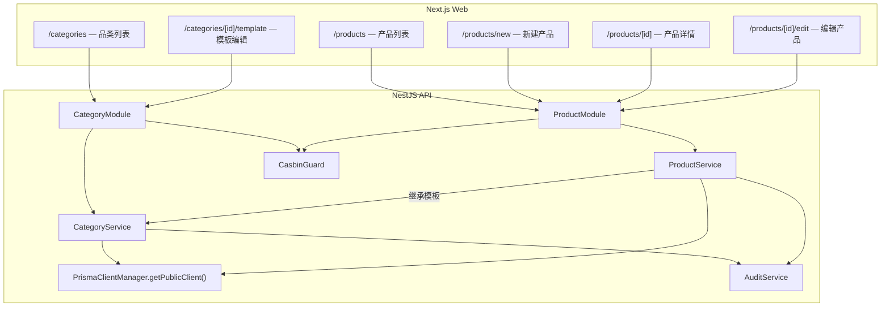
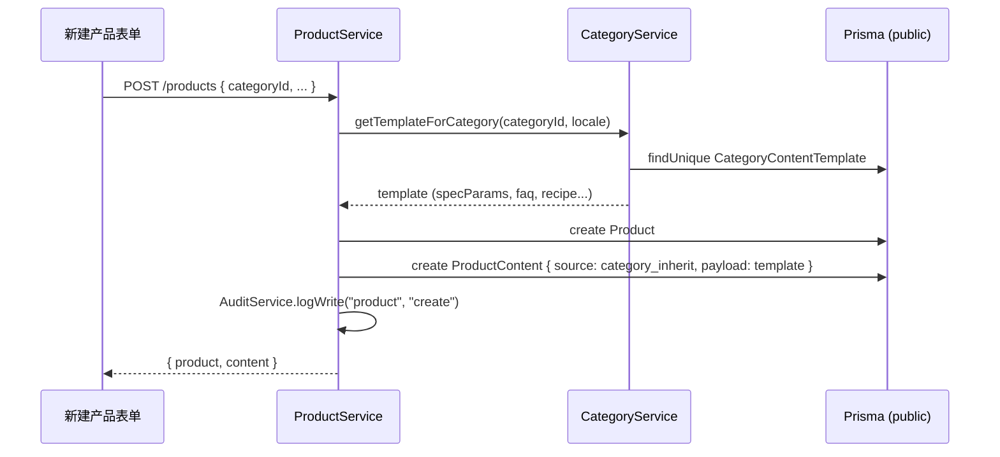
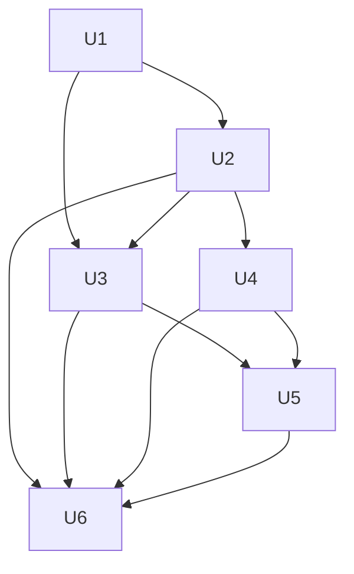

# feat: W5 品类库 + W6 产品中心路径 B 联合实施

## Overview

在 W4 完成管理后台壳层、IAM 联调和 ES 初始化后，本计划交付 S1 首个核心业务模块：品类库 CRUD（含内容模板与继承管线）和产品中心（产品创建/列表/详情/编辑，FAQ/菜谱人工填写）。目标是打通"品类定义 → 品类模板 → 产品创建时继承 → 运营覆盖编辑"的闭环，让 Homtone 品牌首批运营人员可以在系统内创建和管理产品。

---

## Problem Frame

当前仓库数据模型已定义 `Category`、`CategoryContentTemplate`、`Product`、`ProductContent` 等表，但缺少 CRUD API、前端页面和品类继承逻辑。Prisma schema 中 `CategoryContentTemplate` 仅有 `titleTemplate`/`bulletsTemplate`/`descriptionGuide`，与实施方案要求的丰富模板字段（规格参数、功能词、卖点、FAQ、菜谱、`requires_recipe`）存在差距。`ProductContentSource` 枚举缺少 `category_inherit` 值。需在本计划中对齐 schema 与业务需求，交付完整的 CRUD + 继承链路。

(see origin: `docs/yaemartOS-implementation-plan.md` W5/W6, `docs/ui/C-product-center.md`)

---

## Requirements Trace

- R1. 品类 CRUD：创建/读取/更新/删除品类，支持品牌隔离与层级关系（父子品类）。
- R2. 品类内容模板：规格参数定义、功能词库、卖点库、FAQ 模板、菜谱模板（`requires_recipe` 开关控制）。
- R3. 品类继承管线：新建产品时自动拉取品类模板填充 `product_content`，`source=category_inherit`。
- R4. 产品 CRUD：创建/列表/详情/编辑产品，含品牌、品类、市场关联。
- R5. FAQ/菜谱人工填写：运营可在产品维度覆盖品类模板内容，覆盖后 `source` 变为 `manual`。
- R6. 来源标签三色区分：`category_inherit`（蓝）/ `manual`（灰）/ `ai_generated`（紫，S2 占位）。
- R7. 权限与审计：品类/产品写操作记录审计日志，IAM 能力控制菜单与 API 访问。

---

## Scope Boundaries

- 不在本计划实现 AI 生成 FAQ/菜谱（推迟到 S2 W14）。
- 不在本计划实现 Listing 创建/编辑（W9-W10 专项）。
- 不在本计划实现产品图片上传到 Cloudinary（可在后续 PR 补充）。
- 不在本计划实现存量数据迁移/路径 A 提取（W12）。
- 不在本计划实现 Article（SKU/ASIN）子表 CRUD（可作为 W6 后续补充，或随产品中心 V2 迭代）。

### Deferred to Follow-Up Work

- Article CRUD（SKU/ASIN 关联）：W6 后续 PR。
- 产品图片管理（Cloudinary 集成）：独立 PR，依赖 ADR-007。
- 品类/产品数据写入 ES 索引：W11。

---

## Context & Research

### Relevant Code and Patterns

- Prisma schema：`apps/api/prisma/schema.prisma` — `Category`、`CategoryContentTemplate`、`Product`、`ProductContent` 已定义，需扩展。
- NestJS CRUD 模式参考：`apps/api/src/auth/` — DTO + Guard + Service + Controller + Audit。
- 前端 Admin Shell：`apps/web/components/admin/` — sidebar 已预留 `/products`、`/categories`、`/listings` 导航。
- UI 设计规范：`docs/ui/C-product-center.md` — 品类列表、模板编辑、产品列表/新建/详情全套设计。
- 品牌主题：`apps/web/providers/brand-provider.tsx` — `data-brand` + CSS 变量驱动。
- IAM 能力：`apps/api/src/iam/iam.controller.ts` — 已包含 `products:read/write`、`categories:read` capability。
- 审计服务：`apps/api/src/common/audit/audit.service.ts` — `logWrite` 方法可直接复用。
- 数据库访问：产品/品类在 `public` schema，使用 `PrismaClientManager.getPublicClient()`。

### Institutional Learnings

- `docs/solutions/backend-patterns/nestjs-prisma-neon-multitenant-2026-04-30.md`：审计日志建议扩展 + PG 触发器，AUDITED_MODELS 含 Category/Product。
- ADR-001：表单栈定为 react-hook-form + zod（前端），class-validator + zod（后端）。

### External References

- 本轮不新增外部调研，遵循仓内 ADR 与 UI 规范。

---

## Key Technical Decisions

- Schema 扩展采用"在 `CategoryContentTemplate` 增加 JSON 字段"策略，用 `specParams`（Json）、`featureWords`（Json）、`sellingPoints`（Json）、`faqTemplate`（Json）、`recipeTemplate`（Json）存储模板内容，避免增加过多关联表。
- `Category` 增加 `requiresRecipe`（Boolean）字段，控制菜谱模板的可见性。
- `ProductContentSource` 枚举增加 `category_inherit` 值，用于区分继承与手动填写。
- 品类继承在后端 Service 层实现：产品创建时接收 `categoryId`，Service 自动查询模板并写入 `ProductContent`（`source=category_inherit`）。
- 前端采用 Server Component（列表页）+ Client Component（表单页）混合模式。列表页数据在服务端获取；表单页使用 `use client` + fetch 交互。
- 品类/产品 API 均在 `public` schema 操作，通过 `PRISMA_PUBLIC_CLIENT` 注入。
- 前端暂不引入 react-hook-form / zod（ADR-001 目标，但当前仓库尚未落地），保持与登录页一致的 `useState` 表单模式，避免本 PR 引入过多新依赖。

---

## Open Questions

### Resolved During Planning

- 品类层级：S1 仅支持两级（父-子），UI 用级联 Select 展示。深层级延后到 S2+。
- 产品状态：S1 仅 `draft` / `active`，`discontinued` 延后。
- 表单校验：后端用 `class-validator` DTO 验证，前端用原生 HTML5 + 手动校验。
- 分页：产品列表后端返回 `{ data, total, page, pageSize }`，前端简单翻页。

### Deferred to Implementation

- `specParams` JSON 的具体 schema 验证（是否需要 JSON Schema 校验，或仅做存取）。
- 品类模板编辑页的表单交互细节（动态字段增删）。

---

## High-Level Technical Design

> _This illustrates the intended approach and is directional guidance for review, not implementation specification. The implementing agent should treat it as context, not code to reproduce._

品类继承数据流：

---

## Implementation Units

- [x] U1. **Schema 扩展与迁移**

**Goal:** 对齐 Prisma schema 与 W5/W6 业务需求：扩展 `CategoryContentTemplate`、`Category`，补充 `ProductContentSource` 枚举值。

**Requirements:** R1, R2, R3

**Dependencies:** None

**Files:**

- Modify: `apps/api/prisma/schema.prisma`
- Create: `apps/api/prisma/migrations/20260501_w5_category_template_expand/migration.sql`
- Modify: `packages/shared-types/src/index.ts`

**Approach:**

- `CategoryContentTemplate` 增加字段：`specParams Json?`、`featureWords Json?`、`sellingPoints Json?`、`faqTemplate Json?`、`recipeTemplate Json?`。
- `Category` 增加 `requiresRecipe Boolean @default(false)`。
- `ProductContentSource` 枚举增加 `category_inherit`。
- 运行 `prisma migrate dev` 生成迁移。

**Patterns to follow:**

- `apps/api/prisma/migrations/20260501100000_w3_auth_iam_foundation/migration.sql`

**Test scenarios:**

- Happy path: 迁移成功执行，新字段可读写。
- Edge case: 重复执行迁移无副作用（幂等）。

**Verification:**

- `prisma migrate deploy` 成功，`prisma generate` 无错误，typecheck 通过。

---

- [x] U2. **品类 CRUD 后端模块**

**Goal:** 交付品类的完整 CRUD API（创建/列表/详情/更新/删除）+ 模板读写。

**Requirements:** R1, R2, R7

**Dependencies:** U1

**Files:**

- Create: `apps/api/src/category/category.module.ts`
- Create: `apps/api/src/category/category.controller.ts`
- Create: `apps/api/src/category/category.service.ts`
- Create: `apps/api/src/category/dto/create-category.dto.ts`
- Create: `apps/api/src/category/dto/update-category.dto.ts`
- Create: `apps/api/src/category/dto/update-template.dto.ts`
- Modify: `apps/api/src/app.module.ts`
- Modify: `apps/api/src/iam/iam.controller.ts`
- Test: `apps/api/src/category/category.service.spec.ts`

**Approach:**

- `CategoryService` 注入 `PrismaClientManager`，使用 `getPublicClient()` 操作 `public` schema。
- CRUD 端点：`GET /categories`（列表，含分页+品牌筛选）、`POST /categories`、`GET /categories/:id`、`PATCH /categories/:id`、`DELETE /categories/:id`。
- 模板端点：`GET /categories/:id/template`、`PUT /categories/:id/template`。
- 所有写操作触发 `AuditService.logWrite`。
- 新增 `categories:write` 到 IAM 已知能力列表（`iam.controller.ts` KNOWN_OBJECTS）。
- 使用 `@UseGuards(JwtAuthGuard, CasbinGuard)` + `@RequirePolicy` 保护端点。
- `DELETE` 有关联产品时拒绝（`onDelete: Restrict` 已在 schema 中配置）。

**Patterns to follow:**

- `apps/api/src/auth/auth.controller.ts`（Guard + DTO 模式）
- `apps/api/src/common/audit/audit.service.ts`

**Test scenarios:**

- Happy path: 创建品类成功返回完整数据；列表返回分页结果。
- Happy path: 更新模板后重新读取返回新内容。
- Edge case: 创建重复 `slug` 返回 409 Conflict。
- Error path: 删除有关联产品的品类返回 409。
- Error path: 无 JWT token 返回 401；无权限返回 403。

**Verification:**

- 品类 CRUD + 模板读写 API 可正常调用，审计日志有记录。

---

- [x] U3. **产品 CRUD 后端模块 + 品类继承**

**Goal:** 交付产品 CRUD API + 创建产品时自动执行品类模板继承。

**Requirements:** R3, R4, R5, R6, R7

**Dependencies:** U1, U2

**Files:**

- Create: `apps/api/src/product/product.module.ts`
- Create: `apps/api/src/product/product.controller.ts`
- Create: `apps/api/src/product/product.service.ts`
- Create: `apps/api/src/product/dto/create-product.dto.ts`
- Create: `apps/api/src/product/dto/update-product.dto.ts`
- Create: `apps/api/src/product/dto/update-content.dto.ts`
- Modify: `apps/api/src/app.module.ts`
- Test: `apps/api/src/product/product.service.spec.ts`

**Approach:**

- `ProductService` 在创建产品时调用 `CategoryService.getTemplate(categoryId, locale)` 获取模板。
- 如果模板存在，自动创建 `ProductContent` 记录：`source=category_inherit`，`payload` 包含继承的 FAQ/菜谱/规格参数等。
- 端点：`GET /products`（分页+品牌+品类+状态筛选）、`POST /products`、`GET /products/:id`（含关联 content）、`PATCH /products/:id`、`DELETE /products/:id`。
- 内容端点：`PUT /products/:id/content`（更新 FAQ/菜谱，若来源为 `category_inherit` 则自动切换为 `manual`）。
- 产品列表返回 `_count.listings` 以显示 Listing 数量。
- `DELETE` 有 `status != 'archived'` 的 Listing 时拒绝删除。

**Patterns to follow:**

- `apps/api/src/category/category.service.ts`（U2 产出）

**Test scenarios:**

- Happy path: 创建产品时自动继承品类模板，`ProductContent.source` 为 `category_inherit`。
- Happy path: 更新继承内容后 `source` 变为 `manual`。
- Happy path: 列表分页与筛选正确返回。
- Edge case: 品类无模板时创建产品不生成 `ProductContent`。
- Edge case: 创建重复 SKU 返回 409。
- Error path: 删除有 `status != 'archived'` 的 Listing 的产品返回 409。
- Integration: 产品创建触发审计日志。

**Verification:**

- 品类继承链路可复现；产品 CRUD 完整，内容覆盖机制生效。

---

- [x] U4. **品类前端页面（列表 + 模板编辑）**

**Goal:** 落地品类列表页和模板编辑页，遵循 `docs/ui/C-product-center.md` 设计。

**Requirements:** R1, R2

**Dependencies:** U2

**Files:**

- Create: `apps/web/app/[locale]/(admin)/categories/page.tsx`
- Create: `apps/web/app/[locale]/(admin)/categories/new/page.tsx`
- Create: `apps/web/app/[locale]/(admin)/categories/[id]/page.tsx`
- Create: `apps/web/app/[locale]/(admin)/categories/[id]/template/page.tsx`
- Create: `apps/web/components/category/category-list.tsx`
- Create: `apps/web/components/category/category-form.tsx`
- Create: `apps/web/components/category/template-editor.tsx`
- Test: `apps/web/components/category/category-list.spec.tsx`

**Approach:**

- 列表页：展示品类名称（父·子）、品牌、产品数、模板状态、菜谱标记。支持搜索和品牌筛选。
- 模板编辑页：规格参数定义（动态增删字段）、功能词库（Tag 输入）、卖点库（Tag 输入）、FAQ 模板（可编辑列表）、菜谱模板（条件显示）。
- 数据通过 `NEXT_PUBLIC_API_URL` fetch 获取，带 JWT token 和 brand header。
- 遵循 `docs/ui/B-admin-shell.md` 列表页/表单页模板规格。

**Patterns to follow:**

- `apps/web/app/[locale]/(admin)/dashboard/page.tsx`（admin 路由结构）
- `docs/ui/C-product-center.md` §2（品类 UI 设计）
- `docs/ui/B-admin-shell.md` §5（列表/表单模板）

**Test scenarios:**

- Happy path: 品类列表正确渲染，包含关键列。
- Edge case: 空品类列表显示空状态。
- Error path: API 错误时显示错误提示。

**Verification:**

- 品类列表可访问，模板编辑可保存，视觉符合设计规范。

---

- [x] U5. **产品前端页面（列表 + 新建 + 详情）**

**Goal:** 落地产品列表、新建表单（含品类继承 UI）、详情页（Tab 布局）和编辑页。

**Requirements:** R3, R4, R5, R6

**Dependencies:** U3, U4

**Files:**

- Create: `apps/web/app/[locale]/(admin)/products/page.tsx`
- Create: `apps/web/app/[locale]/(admin)/products/new/page.tsx`
- Create: `apps/web/app/[locale]/(admin)/products/[id]/page.tsx`
- Create: `apps/web/app/[locale]/(admin)/products/[id]/edit/page.tsx`
- Create: `apps/web/components/product/product-list.tsx`
- Create: `apps/web/components/product/product-form.tsx`
- Create: `apps/web/components/product/product-detail-tabs.tsx`
- Create: `apps/web/components/product/source-badge.tsx`
- Test: `apps/web/components/product/product-list.spec.tsx`

**Approach:**

- 产品列表页：表格展示产品名、SKU、品牌、品类、状态、Listing 数量，支持品牌/品类/状态/来源筛选 + 分页。S1 状态筛选仅含 `draft` / `active`，忽略 UI 规范中的 `discontinued`（延后到 S2）。
- 新建表单：选定品类后动态渲染继承的规格参数、FAQ、菜谱（`requires_recipe` 控制），来源标签三色区分。
- 详情页 Tab 布局：基本信息、Listing（占位）、FAQ/菜谱、审计日志。
- `source-badge.tsx` 统一渲染来源标签组件。

**Patterns to follow:**

- `docs/ui/C-product-center.md` §3-6（产品 UI 全套设计）
- `docs/ui/B-admin-shell.md` §5（详情页/表单页模板）

**Test scenarios:**

- Happy path: 产品列表正确渲染，来源标签颜色正确。
- Happy path: 新建产品选定品类后显示继承内容并标记来源。
- Edge case: 编辑继承内容后来源标签从蓝变灰（`category_inherit` → `manual`）。
- Edge case: 空产品列表显示空状态。
- Error path: 缺少必填字段时表单提示错误。

**Verification:**

- 产品创建到详情查看的完整流程可走通；来源标签正确反映数据来源。

---

- [x] U6. **CI 对齐与侧栏导航修复**

**Goal:** 确保新模块在 CI 中可测试，修复侧栏导航 href 使其与 locale 路由一致。

**Requirements:** R7

**Dependencies:** U2, U3, U4, U5

**Files:**

- Modify: `apps/web/components/admin/admin-sidebar.tsx`
- Modify: `.github/workflows/ci.yml`
- Test: `tests/e2e/w5-category-crud.spec.ts`
- Test: `tests/e2e/w6-product-crud.spec.ts`

**Approach:**

- 侧栏 `NavItem.href` 目前不含 locale 前缀（如 `/products`），需确认是否与 Next.js `[locale]` 路由兼容，若不兼容则修复。
- CI 测试 job 增加品类/产品 API 的 e2e 断言。
- 品类/产品 API 不引入新环境变量。

**Patterns to follow:**

- `.github/workflows/ci.yml`（现有 e2e 配置）

**Test scenarios:**

- Happy path: CI 执行品类/产品 API 单测全绿。
- Happy path: e2e 测试品类创建 + 产品创建 + 继承链路。
- Edge case: 未认证调用品类/产品 API 返回 401。

**Verification:**

- CI pipeline 可稳定复跑 W5/W6 相关测试。

---

## Dependency Flow

---

## System-Wide Impact

- **Interaction graph:** `Admin Sidebar → Category/Product Pages → API Category/ProductModule → PrismaClientManager(public) → PostgreSQL`。品类继承触发跨 Service 调用（`ProductService → CategoryService`）。
- **Error propagation:** 品类删除受 FK Restrict 保护；产品删除受 Listing 状态检查保护。API 层统一返回 `409 Conflict` 并附诊断信息。
- **State lifecycle risks:** 品类模板更新不自动回溯已继承的产品内容（继承仅在创建时发生）。这是有意设计——避免批量数据变更风险，后续可添加"重新继承"批量操作。
- **API surface parity:** IAM 已包含 `products:read/write`、`categories:read`，需补充 `categories:write`。
- **Integration coverage:** 需覆盖品类创建 → 模板配置 → 产品创建 → 内容继承 → 内容覆盖的完整链路。
- **Unchanged invariants:** 保持现有 tenant 机制不变——品类/产品在 `public` schema，tenant 仅影响请求上下文与 IAM 判定。

---

## Risks & Dependencies

| Risk                                                            | Mitigation                                                           |
| --------------------------------------------------------------- | -------------------------------------------------------------------- |
| CategoryContentTemplate JSON 字段缺乏结构验证，可能写入无效数据 | 后端 DTO 做基本类型校验（非空、数组格式），深层 JSON Schema 验证延后 |
| 品类模板更新后已继承的产品内容不同步                            | 有意设计——继承仅在创建时发生，文档明确告知运营                       |
| 前端暂不用 react-hook-form + zod，表单校验体验可能不够完善      | S1 Alpha 5 人可接受；后续统一升级表单栈时一并改进                    |
| 品类层级仅两级，后续需要深层级时需改造级联选择器                | S1 不涉及深层级，级联 Select 足够                                    |

---

## Documentation / Operational Notes

- 品类/产品 API 端点列表补入 `README.md`。
- 品类模板 JSON 字段结构约定补入 `CONTRIBUTING.md` 或独立文档。

---

## Sources & References

- **Origin document:** `docs/yaemartOS-implementation-plan.md` (W5 §480-486, W6 §487-494)
- UI spec: `docs/ui/C-product-center.md`
- Admin shell spec: `docs/ui/B-admin-shell.md`
- Design system: `docs/ui/A-design-system.md`
- ADR-001: `docs/adr/ADR-001-tech-stack.md`
- Institutional learnings:
  - `docs/solutions/backend-patterns/nestjs-prisma-neon-multitenant-2026-04-30.md`
