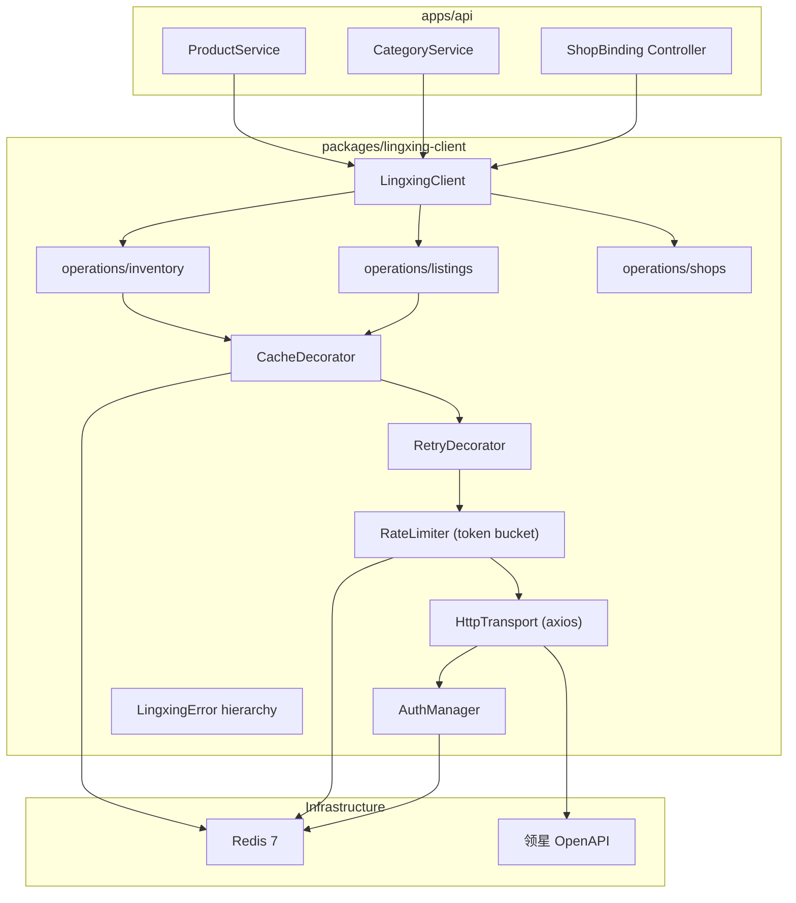

# W7 领星 OpenAPI 凭证管理 + 店铺绑定 + 只读数据拉取

## Overview

构建 `@yaemartos/lingxing-client` 包骨架，实现领星 OpenAPI 凭证管理（token 获取/刷新/Redis 缓存）、HTTP 传输层（限流/重试/错误层级）、`listings.getByAsin` + `inventory.getSnapshot` 只读操作，以及 ShopBinding 管理 API + 前端界面（勾选同步店铺范围）。

本周是 ADR-004 LingxingClient 中间层的首个可运行切片，为 W8 MCP 封装和 W9-W10 Listing MVP 奠定基础。

---

## Problem Frame

yaemartOS 依赖领星 ERP 作为 Amazon/Walmart 数据源。当前无任何外部 API 客户端基础设施。需要一个统一中间层封装所有领星调用，确保：

- 全局限流（领星 1 req/s 上限）不被多模块争抢
- Token 管理集中（Redis 缓存 + 分布式锁刷新）
- 错误分类可观测、可降级
- 仅绑定店铺生成同步任务

（see origin: `docs/adr/ADR-004-lingxing-client.md`）

---

## Requirements Trace

- R1. 领星 API 凭证管理：启动时获取 access_token，Redis 缓存 + 提前 5min 刷新，并发刷新分布式锁保护
- R2. HTTP 传输层：全局令牌桶限流（1 rps）、指数退避重试（3 次）、超时控制
- R3. 错误类型层级：`LingxingError` → `RateLimitedError` / `AuthFailedError` / `BusinessError` / `NetworkError`
- R4. `listings.getByAsin`：Redis 缓存 TTL 1h，路径 A 产品导入使用
- R5. `inventory.getSnapshot`：Redis 缓存 TTL 15min，库存摘要查询
- R6. ShopBinding 管理 API：勾选同步店铺范围，仅绑定店铺可生成同步任务
- R7. ShopBinding 管理前端：admin 界面显示店铺列表 + 绑定切换
- R8. 对账验证：staging 鉴权成功，抽样 5 条数据误差满足 M-04
- R9. 限流告警：rate limit wait > 5s 时 P3 告警（Sentry event）

---

## Scope Boundaries

- W7 **仅实现只读操作**（listings.getByAsin、inventory.getSnapshot），不含写操作
- 不含 SLO 4 级状态机（推迟到 S2 W14 错误率埋点阶段）
- 不含 BullMQ 镜像同步队列（推迟到 S2 W21 Outbox 增量同步）
- 不含 MCP Agent 桥（推迟到 W8）
- 不含 circuit breaker 熔断器（v2.x）
- 不含 orders / ads 操作（分别在 S3、S4）
- 前端仅 ShopBinding 管理界面，不含库存/Listing 展示页面

### Deferred to Follow-Up Work

- W8: MCP 工具集封装（`mcp-bridge.ts`）
- S2 W14: SLO 错误率埋点 + 降级状态机
- S2 W21: Outbox 增量同步 + BullMQ worker
- S4 W40-W42: `ads.getDaily` 全镜像 + `inventory.*` 双策略 + 完整 SLO 4 级状态机

---

## Context & Research

### Relevant Code and Patterns

- `packages/db/` — 内部包模式：直接 TS 导出 `./src/index.ts`、`noEmit: true`、`workspace:*` 引用
- `apps/api/src/database/database.module.ts` — `@Global()` + `forRoot()` 式 Module 注册
- `apps/api/src/database/prisma.service.ts` — `PrismaClientManager` 单例 + 缓存 Map 模式
- `apps/api/src/common/audit/audit.service.ts` — `logWrite()` 审计日志接口
- `apps/api/src/auth/auth.service.ts` — JWT token 管理模式参考
- `apps/api/prisma/schema.prisma` L348-380 — `Shop` + `ShopBinding` 模型已存在
- `apps/api/.env.local.example` — `LINGXING_APP_KEY/SECRET/BASE_URL` 已预留（注释状态）
- `apps/api/src/category/category.service.spec.ts` — 测试 mock 工厂模式：`createService()` + `vi.fn()`

### Institutional Learnings

- `docs/solutions/backend-patterns/nestjs-prisma-neon-multitenant-2026-04-30.md`：PgBouncer transaction mode 下 Advisory Locks 不可用，分布式锁必须用 Redis。`SET LOCAL` 审计模式。`nestjs-cls` CLS 上下文传播。
- 外部 API 客户端包、Redis 缓存模式、限流模式是空白区域，需要本次建立范式。

### External References

- 领星 OpenAPI 文档：`https://openapi.lingxing.com`（W7 前需与领星技术对齐字段清单）
- `docs/lingxing-field-mapping.md` — 完整字段映射规则和数据类型转换
- `docs/adr/ADR-004-lingxing-client.md` — 完整架构设计蓝图

---

## Key Technical Decisions

- **HTTP 客户端选择 axios**：项目无现有 HTTP 客户端依赖。axios 的 interceptor 天然适合 auth token 自动注入和错误统一处理，生态成熟。W7 引入 `axios`。
- **Redis 客户端选择 ioredis**：生产环境使用 Upstash（HTTP REST），但开发/staging 使用标准 Redis 7（docker-compose）。`ioredis` 是 BullMQ 底层依赖（S2 需要），且支持 Lua scripting（令牌桶）。W7 引入 `ioredis`，通过 `REDIS_URL` 连接。
- **包模式复用 @yaemartos/db**：直接 TypeScript 源码导出，无 build 步骤，`workspace:*` 引用。
- **NestJS 注册模式 `forRoot()`**：`LingxingClientModule.forRoot(options)` 返回 `DynamicModule`，标记 `@Global()`。所有业务模块可直接注入 `LingxingClient`。
- **令牌桶 Redis Lua 实现**：原子性保证限流精确度，支持多实例共享同一令牌桶。阻塞等待 ≤ 30s，超时抛 `RateLimitedError`。
- **Token 刷新分布式锁**：`ioredis` `SET NX EX` 模式，TTL 30s，防止多实例并发刷新。
- **ShopBinding schema 无需修改**：现有 `ShopBinding.bindingToken` + `metadata` 字段足以存储领星绑定信息（`metadata` 存 `{ lingxingShopId, syncEnabled, allowedShopIds }` 等）。需新增 `syncEnabled Boolean @default(false)` 字段到 `ShopBinding`。

---

## Open Questions

### Resolved During Planning

- **Q: Redis 在 dev/staging 如何使用？** docker-compose 已配置 Redis 7-alpine（端口 6379），`REDIS_URL=redis://localhost:6379` 在 `.env.local.example` 已预留。
- **Q: ShopBinding 模型需要扩展吗？** 需要增加 `syncEnabled` 字段和 `lingxingShopId`，通过 Prisma migration 添加。
- **Q: 领星 API 凭证变量命名？** `.env.local.example` 已预留 `LINGXING_APP_KEY`, `LINGXING_APP_SECRET`, `LINGXING_BASE_URL`。

### Deferred to Implementation

- **领星 API 真实响应结构**：需要 staging 联调时录制 fixtures 确认。先按 `docs/lingxing-field-mapping.md` 定义类型。
- **Upstash 生产环境 Redis 适配**：ioredis 是否能直接连 Upstash Redis（支持 TLS），或需要用 `@upstash/redis` REST 客户端。留到部署阶段确认。

---

## Output Structure

```
packages/lingxing-client/
├── package.json
├── tsconfig.json
├── src/
│   ├── index.ts                          # barrel export
│   ├── lingxing-client.module.ts         # NestJS DynamicModule (forRoot)
│   ├── lingxing-client.ts                # 主 injectable service
│   ├── lingxing-client.options.ts        # forRoot 配置 interface
│   ├── client/
│   │   ├── http-transport.ts             # axios wrapper + interceptor
│   │   └── auth-manager.ts              # token 获取/刷新/Redis 缓存
│   ├── decorators/
│   │   ├── rate-limiter.ts              # 令牌桶 (Redis Lua)
│   │   ├── retry.ts                     # 指数退避重试
│   │   └── cached.ts                    # Redis cache decorator
│   ├── operations/
│   │   ├── listings.ts                  # listings.getByAsin
│   │   ├── inventory.ts                 # inventory.getSnapshot
│   │   └── shops.ts                     # shops.list (for binding UI)
│   ├── errors/
│   │   ├── lingxing-error.ts            # base error + subclasses
│   │   └── error-codes.ts              # 错误码常量
│   └── types/
│       ├── listing.types.ts             # API response types
│       ├── inventory.types.ts
│       └── shop.types.ts
├── test/
│   ├── auth-manager.spec.ts
│   ├── http-transport.spec.ts
│   ├── rate-limiter.spec.ts
│   ├── retry.spec.ts
│   ├── cached.spec.ts
│   ├── listings.spec.ts
│   ├── inventory.spec.ts
│   └── fixtures/
│       ├── auth-response.json
│       ├── listing-response.json
│       └── inventory-response.json
```

---

## High-Level Technical Design

> _This illustrates the intended approach and is directional guidance for review, not implementation specification. The implementing agent should treat it as context, not code to reproduce._



调用链：`Operation → Cache → Retry → RateLimiter → HttpTransport(+AuthManager) → 领星 API`

每一层作为方法装饰器或组合函数包裹，遵循洋葱模型。

---

## Implementation Units

- [ ] U1. **lingxing-client 包骨架 + 错误类型层级**

**Goal:** 创建 `packages/lingxing-client` 包结构、NestJS `DynamicModule`、配置接口、`LingxingError` 类层级。

**Requirements:** R3

**Dependencies:** None

**Files:**

- Create: `packages/lingxing-client/package.json`
- Create: `packages/lingxing-client/tsconfig.json`
- Create: `packages/lingxing-client/src/index.ts`
- Create: `packages/lingxing-client/src/lingxing-client.module.ts`
- Create: `packages/lingxing-client/src/lingxing-client.ts`
- Create: `packages/lingxing-client/src/lingxing-client.options.ts`
- Create: `packages/lingxing-client/src/errors/lingxing-error.ts`
- Create: `packages/lingxing-client/src/errors/error-codes.ts`
- Create: `packages/lingxing-client/vitest.config.ts`
- Modify: `apps/api/package.json` — 添加 `"@yaemartos/lingxing-client": "workspace:*"`
- Modify: `apps/api/src/app.module.ts` — 导入 `LingxingClientModule.forRoot(...)`
- Modify: `apps/api/.env.local.example` — 取消注释 `LINGXING_*` 变量
- Test: `packages/lingxing-client/test/errors.spec.ts`

**Approach:**

- `package.json` 参照 `packages/db/package.json`（`main/types/exports` → `./src/index.ts`）
- `LingxingClientModule.forRoot(options)` 返回 `DynamicModule`，用 `@Global()` 标记
- `LingxingClientOptions` interface: `{ appKey, appSecret, baseUrl, redisUrl, rateLimitRps?, cachePrefix? }`
- `LingxingError` 带 `code`, `status?`, `retryable` 字段，4 个子类按 ADR-004 §2.8

**Patterns to follow:**

- `packages/db/package.json` — 包结构
- `apps/api/src/database/database.module.ts` — `@Global()` DynamicModule 模式
- `apps/api/src/ai/tokens.ts` — Symbol provider token

**Test scenarios:**

- Happy path: `LingxingError` 各子类实例化后 `code`, `retryable` 属性正确
- Happy path: `RateLimitedError instanceof LingxingError` 为 true
- Happy path: `AuthFailedError.retryable` 为 false, `NetworkError.retryable` 为 true

**Verification:**

- `pnpm install` 成功解析 `@yaemartos/lingxing-client`
- API typecheck 通过
- Error 类单元测试全绿

---

- [ ] U2. **HttpTransport + AuthManager (token 获取/刷新/Redis 缓存)**

**Goal:** 实现 axios-based HTTP 传输层和领星 token 自动管理（获取 → Redis 缓存 → 提前刷新 → 分布式锁防并发）。

**Requirements:** R1, R2 (partial)

**Dependencies:** U1

**Files:**

- Create: `packages/lingxing-client/src/client/http-transport.ts`
- Create: `packages/lingxing-client/src/client/auth-manager.ts`
- Modify: `packages/lingxing-client/src/lingxing-client.module.ts` — 注册 providers
- Modify: `packages/lingxing-client/package.json` — 添加 `axios`, `ioredis` 依赖
- Test: `packages/lingxing-client/test/auth-manager.spec.ts`
- Test: `packages/lingxing-client/test/http-transport.spec.ts`
- Create: `packages/lingxing-client/test/fixtures/auth-response.json`

**Approach:**

- `HttpTransport`: axios instance + request interceptor 自动注入 `Authorization: Bearer {token}`
- `AuthManager`: 启动时调 `/v1/auth` 获取 token；存入 Redis key `lingxing:token`，TTL = 过期时间 - 5min
- Token 刷新：`ioredis` `SET lingxing:token:lock NX EX 30`，获取锁后刷新，其他实例轮询等待
- 连续 3 次刷新失败 → 抛 `AuthFailedError` + Sentry event
- Token 不写入日志（logger redaction）

**Patterns to follow:**

- `apps/api/src/auth/auth.service.ts` — JWT token 管理模式
- ADR-004 §2.3 — Auth 管理详细设计

**Test scenarios:**

- Happy path: AuthManager.getToken() 首次调 API 获取 token 并写入 Redis
- Happy path: AuthManager.getToken() 命中 Redis 缓存直接返回
- Happy path: Token 过期后自动刷新成功
- Edge case: 并发请求时仅一个实例刷新 token（分布式锁）
- Error path: API 返回 401 → 抛 `AuthFailedError`
- Error path: 连续 3 次刷新失败 → 抛 `AuthFailedError`
- Error path: 网络超时 → 抛 `NetworkError`
- Integration: HttpTransport 请求自动携带 Authorization header

**Verification:**

- 单元测试全绿（mock Redis + mock axios）
- TypeCheck 通过

---

- [ ] U3. **限流令牌桶 + 指数退避重试 + Redis 缓存装饰器**

**Goal:** 实现三个核心横切关注点：Redis Lua 令牌桶限流、指数退避重试策略、Redis 缓存装饰器。

**Requirements:** R2, R9

**Dependencies:** U1, U2

**Files:**

- Create: `packages/lingxing-client/src/decorators/rate-limiter.ts`
- Create: `packages/lingxing-client/src/decorators/retry.ts`
- Create: `packages/lingxing-client/src/decorators/cached.ts`
- Test: `packages/lingxing-client/test/rate-limiter.spec.ts`
- Test: `packages/lingxing-client/test/retry.spec.ts`
- Test: `packages/lingxing-client/test/cached.spec.ts`

**Approach:**

- **RateLimiter**: Redis Lua 脚本原子递减令牌桶。配置 `rps` (default 1)、`maxWaitMs` (default 30000)。等待时 `await sleep()` 循环重试。超时 → `RateLimitedError`。wait > 5s 时发 Sentry event (R9)。
- **RetryDecorator**: 高阶函数包裹 operation 调用。`maxAttempts: 3`, `baseDelayMs: 500`, exponential backoff。仅对 `retryable === true` 的错误重试（408/429/500/502/503/504/NETWORK_ERROR）。400/401/403/404/422 不重试。
- **CachedDecorator**: 高阶函数。Redis GET → hit 直接返回 parsed JSON；miss → 执行 fn → SET EX。key 格式 `lingxing:cache:{operation}:{hash(args)}`。TTL 由调用方指定。

**Patterns to follow:**

- ADR-004 §2.4 (令牌桶), §2.5 (重试), §2.6 (缓存)

**Test scenarios:**

- Happy path: RateLimiter 在桶有 token 时立即放行
- Happy path: RetryDecorator 首次成功不重试
- Happy path: CachedDecorator 缓存命中直接返回
- Happy path: CachedDecorator 缓存 miss → 执行 → 写缓存
- Edge case: RateLimiter 桶为空时等待后放行
- Edge case: RetryDecorator 第 1 次失败 500ms 后第 2 次成功
- Error path: RateLimiter 等待超过 maxWaitMs → RateLimitedError
- Error path: RetryDecorator 3 次全失败 → 抛原始错误
- Error path: RetryDecorator 对 400/401 不重试直接抛出
- Integration: RateLimiter wait > 5000ms 触发 Sentry event

**Verification:**

- 三个装饰器单元测试全绿
- TypeCheck 通过

---

- [ ] U4. **listings.getByAsin + inventory.getSnapshot 操作实现**

**Goal:** 实现两个只读数据操作：Listing 元数据查询（1h 缓存）和库存快照查询（15min 缓存），以及 API 响应类型定义。

**Requirements:** R4, R5, R8

**Dependencies:** U1, U2, U3

**Files:**

- Create: `packages/lingxing-client/src/types/listing.types.ts`
- Create: `packages/lingxing-client/src/types/inventory.types.ts`
- Create: `packages/lingxing-client/src/types/shop.types.ts`
- Create: `packages/lingxing-client/src/operations/listings.ts`
- Create: `packages/lingxing-client/src/operations/inventory.ts`
- Create: `packages/lingxing-client/src/operations/shops.ts`
- Modify: `packages/lingxing-client/src/lingxing-client.ts` — 组合 operations
- Test: `packages/lingxing-client/test/listings.spec.ts`
- Test: `packages/lingxing-client/test/inventory.spec.ts`
- Create: `packages/lingxing-client/test/fixtures/listing-response.json`
- Create: `packages/lingxing-client/test/fixtures/inventory-response.json`

**Approach:**

- 类型定义参照 `docs/lingxing-field-mapping.md` §2（产品）和 §5（库存）
- `listings.getByAsin(asin, { cache?: { ttl: number } })` → 调 `GET /erp/sc/mws/listing?asin={asin}` → 按 mapping 转换
- `inventory.getSnapshot(marketplaceId, { cache?: { ttl: number } })` → 调 `GET /erp/sc/fba/inventory?marketplace_id={id}`
- `shops.list()` → 调 `GET /erp/sc/shops`（供 ShopBinding 管理使用）
- 每个 operation 使用 `@cached` + `@retry` + 通过 `RateLimiter` 的组合调用链
- `LingxingClient` 主类暴露 `listings`, `inventory`, `shops` 三个命名空间

**Patterns to follow:**

- `docs/lingxing-field-mapping.md` §9 数据类型转换规则 (`LingxingTransformers`)
- ADR-004 §2.6 缓存 TTL 策略

**Test scenarios:**

- Happy path: listings.getByAsin 返回正确映射后的 Listing 数据
- Happy path: inventory.getSnapshot 返回正确映射后的库存数组
- Happy path: shops.list 返回店铺列表
- Happy path: 缓存命中时不调 API
- Edge case: API 返回空数组 → 返回空数组（不抛错）
- Edge case: API 返回额外未知字段 → 忽略（不报错）
- Error path: API 返回 404（ASIN 不存在）→ 返回 null
- Error path: API 返回 500 → 重试 3 次后抛 `LingxingError`
- Integration: 完整调用链 cache → retry → rate-limit → transport → mock API

**Verification:**

- 使用 fixtures 数据的单元测试全绿
- `LingxingClient` 可被 NestJS DI 正确注入

---

- [ ] U5. **ShopBinding API + Prisma schema 扩展**

**Goal:** 为 ShopBinding 添加 `syncEnabled` 和 `lingxingShopId` 字段，实现 ShopBinding 管理 API（列表/绑定/解绑），并集成 `LingxingClient.shops.list()` 获取可绑定店铺。

**Requirements:** R6

**Dependencies:** U1, U4

**Files:**

- Create: `apps/api/prisma/migrations/20260501_w7_shop_binding_sync/migration.sql`
- Modify: `apps/api/prisma/schema.prisma` — `ShopBinding` 增加 `syncEnabled`, `lingxingShopId`
- Create: `apps/api/src/shop/shop.module.ts`
- Create: `apps/api/src/shop/shop.controller.ts`
- Create: `apps/api/src/shop/shop.service.ts`
- Create: `apps/api/src/shop/dto/bind-shop.dto.ts`
- Create: `apps/api/src/shop/dto/update-binding.dto.ts`
- Modify: `apps/api/src/app.module.ts` — 导入 `ShopModule`
- Modify: `apps/api/src/iam/iam.controller.ts` — `KNOWN_OBJECTS` 添加 `shops:write`
- Test: `apps/api/src/shop/shop.service.spec.ts`

**Approach:**

- Schema migration: `ALTER TABLE "ShopBinding" ADD COLUMN "syncEnabled" BOOLEAN DEFAULT false, ADD COLUMN "lingxingShopId" TEXT`
- `ShopController`:
  - `GET /api/shops` — 列出当前品牌的 Shop + binding 状态
  - `GET /api/shops/lingxing-available` — 调 `LingxingClient.shops.list()` 获取领星可用店铺
  - `POST /api/shops/:id/bind` — 绑定/更新店铺
  - `PATCH /api/shops/:id/binding` — 切换 `syncEnabled`
- Guard: `JwtAuthGuard` + `CasbinGuard` + `@RequirePolicy({ obj: 'shops', act: 'write' })`
- 写操作走 `AuditService.logWrite()`

**Patterns to follow:**

- `apps/api/src/category/category.controller.ts` — CRUD controller 模式
- `apps/api/src/category/category.service.ts` — PrismaClientManager + AuditService 注入

**Test scenarios:**

- Happy path: 列出品牌下所有 Shop 及 binding 状态
- Happy path: 获取领星可用店铺列表
- Happy path: 绑定店铺成功 → ShopBinding 创建 + syncEnabled=true
- Happy path: 切换 syncEnabled → 成功更新
- Edge case: 已绑定店铺再次绑定 → 更新已有 binding
- Error path: Shop 不存在 → 404
- Error path: 无 `shops:write` 权限 → 403
- Integration: bind 操作写入 AuditLog

**Verification:**

- Prisma migration 成功执行
- API typecheck 通过
- 单元测试全绿

---

- [ ] U6. **ShopBinding 管理前端**

**Goal:** 在 admin 界面实现店铺绑定管理页面：显示店铺列表、领星店铺选择、绑定/解绑操作、同步开关。

**Requirements:** R7

**Dependencies:** U5

**Files:**

- Create: `apps/web/app/[locale]/(admin)/shops/page.tsx`
- Create: `apps/web/components/shop/shop-binding-list.tsx`
- Create: `apps/web/components/shop/shop-binding-list.spec.tsx`
- Create: `apps/web/lib/api/shop-client.ts`
- Modify: `apps/web/components/admin/admin-sidebar.tsx` — 添加 "店铺管理" 菜单项
- Modify: `apps/web/messages/en.json` — 添加 shop 相关国际化文案
- Modify: `apps/web/messages/es.json` — 添加 shop 相关国际化文案

**Approach:**

- `shop-client.ts`: `listShops()`, `listLingxingShops()`, `bindShop(id, dto)`, `toggleSync(id, enabled)`
- 页面布局参照品类列表页：表格展示 Shop 列表 + binding 状态 + syncEnabled 开关
- 未绑定店铺显示 "绑定" 按钮 → 弹出选择框从领星可用店铺中选择
- syncEnabled 用 toggle switch 组件
- 需 `shops:write` capability 才显示操作按钮

**Patterns to follow:**

- `apps/web/components/category/category-list.tsx` — 列表页组件模式
- `apps/web/lib/api/catalog-client.ts` — API client 函数模式

**Test scenarios:**

- Happy path: 渲染店铺列表 → 显示名称、品牌、平台、绑定状态
- Happy path: syncEnabled toggle 发送正确 API 请求
- Edge case: 空列表 → 显示空状态提示
- Edge case: 无 `shops:write` capability → 隐藏操作按钮

**Verification:**

- 组件单元测试全绿
- 页面可在 admin shell 中正确渲染

---

- [ ] U7. **E2E 测试 + 集成验证**

**Goal:** 编写 W7 E2E 测试验证领星凭证管理和店铺绑定 API 端到端可用。

**Requirements:** R8

**Dependencies:** U5, U6

**Files:**

- Create: `tests/e2e/w7-lingxing-shop-binding.spec.ts`
- Modify: `scripts/test-e2e-local.sh` — `WEEK_MAP_w7` 添加测试文件
- Modify: `playwright.config.ts` — 确认 webServer env 包含 `LINGXING_*` mock 变量

**Approach:**

- 测试 unauthenticated 访问 `/api/shops` 返回 401
- 测试 shop binding 页面 `/en/shops` 可正常加载
- 测试 `LingxingClient` 基本连通性（mock 模式下）
- 因领星 API 是外部服务，E2E 仅测 API 路由存在 + 前端页面渲染，不测真实领星调用

**Patterns to follow:**

- `tests/e2e/w5-category-crud.spec.ts` — W5 E2E 测试模式

**Test scenarios:**

- Happy path: `/api/shops` 无认证返回 401
- Happy path: `/en/shops` 页面加载成功
- Happy path: `/api/shops` 有认证返回 200 + JSON 数组

**Verification:**

- `pnpm test:e2e tests/e2e/w7-lingxing-shop-binding.spec.ts` 全绿
- 本地 e2e 复测脚本 `./scripts/test-e2e-local.sh w7` 可用

---

## System-Wide Impact

- **Interaction graph:** `LingxingClientModule` 是 `@Global()` 模块，所有后续需要领星数据的模块（Product、Listing、Ads）可直接注入 `LingxingClient`。ShopBinding controller 与现有 `Shop` 模型交互。
- **Error propagation:** `LingxingError` 层级在 controller 层转换为 NestJS HTTP exceptions（`LingxingError` → 500, `AuthFailedError` → 503, `RateLimitedError` → 429, `BusinessError` → 400/404, `NetworkError` → 502）。
- **State lifecycle risks:** Redis token 缓存过期但刷新失败 → 需要 fallback 策略（当前：抛 AuthFailedError + P1 告警）。令牌桶 Redis key 不存在时需自动初始化。
- **API surface parity:** W8 MCP 桥将复用相同的 `LingxingClient` API，不需要额外接口。
- **Integration coverage:** AuthManager token 刷新 + Redis 分布式锁需要集成测试（条件跳过模式，参照 `prisma.constraints.spec.ts`）。
- **Unchanged invariants:** 现有 `Shop` 模型的 CRUD 不变；`ShopBinding` 新增字段不影响已有 binding（migration 添加有默认值的列）。

---

## Risks & Dependencies

| Risk                                | Mitigation                                                                                                                |
| ----------------------------------- | ------------------------------------------------------------------------------------------------------------------------- |
| 领星 API 真实响应可能与文档不一致   | 使用 `test/fixtures/` 录制真实响应；类型定义用 `Partial<>` 防守性处理；schema 加 `extra-fields-allowed`                   |
| Redis 连接在 dev 环境不稳定         | docker-compose 确保 Redis 启动；AuthManager 添加 graceful degradation（Redis 不可用时 fallback 到内存缓存，仅单实例有效） |
| ioredis 与 Upstash 生产环境兼容性   | ioredis 支持 TLS（Upstash 标准协议），需在 staging 验证。降级方案：切换到 `@upstash/redis` REST                           |
| 领星 1 req/s 限流被 CI 并发测试打爆 | 单元测试全部 mock 不调真实 API；集成测试加 `describeWithDb` 式条件跳过                                                    |
| 令牌桶 Lua 脚本逻辑错误             | 独立单元测试 + Redis 集成测试验证原子性                                                                                   |

---

## Documentation / Operational Notes

- W7 完成后运行 `/ce-compound` 记录：外部 API 客户端包模式（HTTP + auth + rate-limit + retry + cache 的标准化组合）
- 更新 `docs/adr/ADR-004-lingxing-client.md` 状态从 "Proposed" → "Accepted"
- 更新 `.env.local.example` 取消 `LINGXING_*` 注释 + 添加说明

---

## Sources & References

- **Origin document:** [docs/adr/ADR-004-lingxing-client.md](docs/adr/ADR-004-lingxing-client.md)
- **Implementation plan:** [docs/yaemartOS-implementation-plan.md](docs/yaemartOS-implementation-plan.md) §6 W7
- **Field mapping:** [docs/lingxing-field-mapping.md](docs/lingxing-field-mapping.md)
- **Learnings:** [docs/solutions/backend-patterns/nestjs-prisma-neon-multitenant-2026-04-30.md](docs/solutions/backend-patterns/nestjs-prisma-neon-multitenant-2026-04-30.md) — PgBouncer 限制 → Redis 分布式锁
- **Existing schema:** [apps/api/prisma/schema.prisma](apps/api/prisma/schema.prisma) L348-380 (Shop + ShopBinding)
