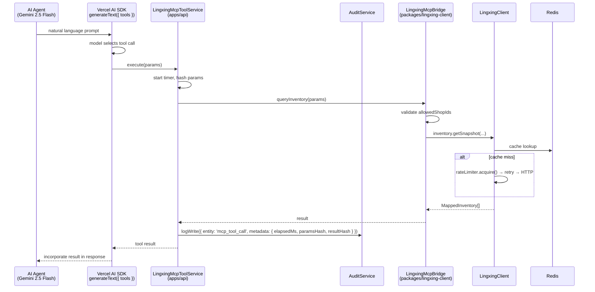

# W8 领星 MCP 工具集封装 + 审计日志

## Overview

为 AI Agent（Gemini 2.5 Flash 工具调用）封装领星三个只读工具：库存快照查询、Listing 摘要、关键词摘要（从 listing backend keywords 提取）。将 `AiModule` 中的 `StubMcpToolCallService` 替换为真实实现，并实现每次工具调用的审计日志。同时扩展 `LingxingClientOptions` 支持 `allowedShopIds`，确保 MCP 工具调用与 REST API 使用同一店铺范围配置。

本周是 ADR-004 §2.9 MCP Agent 桥的首个可运行切片，使 AI Agent 可通过自然语言调通领星数据查询，为 W9–W10 Listing MVP 的竞品分析与关键词辅助奠定基础。

---

## Problem Frame

W7 完成了 `@yaemartos/lingxing-client` 包的核心能力（auth / rate-limit / retry / cache / listings / inventory / shops），但 AI Agent 当前无法调用这些能力：

- `AiModule.MCP_TOOL_CALL_SERVICE` 仍是 `StubMcpToolCallService`（仅 `ping()`）
- 无 Vercel AI SDK `tool()` 定义，Gemini 2.5 Flash 无法理解工具参数
- 无 MCP 调用审计，§2.2 "自然语言调用路径可审计" 原则未满足
- `allowed_shop_ids` 仅在 W7 ShopBinding 前端逻辑存在，未在客户端层面强制校验

（see origin: `docs/adr/ADR-004-lingxing-client.md` §2.9）

---

## Requirements Trace

- R1. 实现 `LingxingMcpBridge` 服务，将三个工具方法代理到 `LingxingClient` 操作，同样走 rate-limiter / retry / cache 调用链
- R2. 定义三个 Vercel AI SDK `tool()` 对象（inventory / listing / keywords），Gemini 2.5 Flash 可通过工具调用触发
- R3. 替换 `AiModule` 中的 stub 为真实的 `LingxingMcpToolService`
- R4. 每次 MCP 工具调用记录审计日志（operation / userId / paramsHash / resultHash / statusCode / elapsedMs）
- R5. `LingxingClientOptions` 增加 `allowedShopIds?: string[]`，bridge 层校验请求 shopId 在允许列表内

---

## Scope Boundaries

- W8 **仅实现只读工具**（查询类）
- 不含写工具（价格修改、广告创建、批量同步）— 推迟到 S4
- 不含 human-in-the-loop confirm UI — 推迟到 S4 高风险操作（§2.9 "高敏感操作"）
- 不含完整 `ads.getDaily` — 推迟到 S4 W40-42；W8 "关键词/广告表现" = 从 listing `searchTerms` 字段提取关键词
- 不含 SLO 状态机接入 — 推迟到 S2 W14 错误率埋点阶段
- 不含 circuit breaker — v2.x
- 不含 MCP 优先级队列（AI Agent vs cron 调用分级）— 推迟到 S4

### Deferred to Follow-Up Work

- W9+: Listing 生成时将 `getKeywordSuggestions` 结果注入 prompt 作为关键词输入
- S2 W14: SLO 状态机接入 `LingxingMcpBridge` 错误率统计
- S4: `ads.getKeywordPerformance`（真实广告关键词数据），替换当前 listing-based 近似实现
- S4: 写工具 + human-in-the-loop confirm（价格修改、广告创建）

---

## Context & Research

### Relevant Code and Patterns

- `packages/lingxing-client/src/lingxing-client.ts` — `LingxingClient` 主 facade，提供 `listings` / `inventory` / `shops` 三个命名空间
- `packages/lingxing-client/src/lingxing-client.options.ts` — `LingxingClientOptions` 配置接口（待扩展）
- `packages/lingxing-client/src/lingxing-client.module.ts` — `@Global()` DynamicModule，`REDIS_CLIENT` / `AuthManager` / `HttpTransport` 已注册
- `apps/api/src/ai/interfaces/mcp-tool-call.interface.ts` — 当前 `IMcpToolCallService { ping() }`（需扩展）
- `apps/api/src/ai/ai.module.ts` — `StubMcpToolCallService` placeholder，`MCP_TOOL_CALL_SERVICE` token 已注册
- `apps/api/src/ai/providers/gemini-listing-generation.service.ts` — Vercel AI SDK `generateText` + `createGoogleGenerativeAI` 使用模式
- `apps/api/src/ai/tokens.ts` — `MCP_TOOL_CALL_SERVICE` Symbol
- `apps/api/src/common/audit/audit.service.ts` — `logWrite({ action, entity, entityId, metadata })` 审计接口
- `apps/api/src/category/category.service.spec.ts` — `createService()` mock 工厂模式

### Institutional Learnings

- `docs/solutions/backend-patterns/nestjs-prisma-neon-multitenant-2026-04-30.md`：`@Global()` 模块模式、nestjs-cls 上下文传播。LingxingClientModule 已是 `@Global()` — `LingxingMcpBridge` 可被 AiModule 直接注入。
- ADR-004 §2.9：MCP 调用必须走全部限流/重试/SLO 状态机，不走旁路。`LingxingMcpBridge` 通过调用 `LingxingClient` 的 operation 方法（已封装 rate-limiter + retry + cache）自然满足此要求。

### External References

- `docs/adr/ADR-004-lingxing-client.md` §2.9 — MCP Agent 桥完整设计
- `docs/yaemartOS-implementation-plan.md` §6 W8 — 实施范围和验收标准
- Vercel AI SDK `tool()` API：zod schema 参数定义 + execute 函数，与 `generateText({ tools })` 一起使用

---

## Key Technical Decisions

- **Audit 在 NestJS 服务层而非 bridge 包**：`LingxingMcpBridge` 保持纯 TypeScript Injectable（不依赖 HTTP audit 基础设施）。审计逻辑放在 `apps/api/src/ai/providers/lingxing-mcp-tool.service.ts` 中，在调用 bridge 方法前后计时并调 `AuditService.logWrite()`。Bridge 包保持可移植性。
- **关键词近似实现**：`getKeywordSuggestions(asin)` 调 `LingxingClient.listings.getByAsin()` 并返回 `MappedListing.searchTerms`（listing backend keywords）。这是 W8 可交付的最小可用实现；S4 替换为 `ads.getKeywordPerformance` 真实广告数据。
- **allowedShopIds 校验位置**：在 `LingxingMcpBridge` 内部校验（不在 operation 层），因为 REST API 路径不走 bridge，不需要在 operation 层添加过滤逻辑。Bridge 拿到 `allowedShopIds` 后对 `shopId` 参数做白名单检查，不合法则抛 `BusinessError`。
- **Vercel AI SDK tools 定义位置**：`apps/api/src/ai/tools/lingxing-tools.ts`，使用 zod 定义参数 schema，`execute` 委托给注入的 `LingxingMcpToolService`。这与现有 `gemini-listing-generation.service.ts` 同目录结构一致（`ai/providers/`），tools 定义分离在 `ai/tools/` 子目录，与 providers 职责区分。
- **IMcpToolCallService 扩展**：扩展接口增加三个方法，保留 `ping()` 保持向后兼容。Stub 实现同步更新以满足接口，保留可在测试中使用的行为。

---

## Open Questions

### Resolved During Planning

- **Q: Vercel AI SDK tool calling 如何与 Gemini 2.5 Flash 集成？** Vercel AI SDK `tool({ description, parameters: zod schema, execute })` + `generateText({ model, tools, prompt })` 模式。现有 `GeminiListingGenerationService.helloWorld()` 验证了 Gemini 连通性，工具调用在此基础上添加 `tools` 参数。
- **Q: 审计日志用现有 `AuditLog` 表还是新表？** 沿用现有 `auditLog` 表（entity='mcp_tool_call', entityId=operation, metadata 含 paramsHash/resultHash/elapsedMs）。避免新增 migration，S2 可按需扩展专用表。
- **Q: `allowedShopIds` 为空（未配置）时行为？** 空数组 = 不限制（pass-through），保持向后兼容，不影响 W7 已有 E2E 测试。

### Deferred to Implementation

- **Vercel AI SDK `tool()` 的 `execute` 是否需要 async context（如 user identity）？** Bridge 层当前无 HTTP request context。如需用户鉴权，待实现时决定是传 userId 参数还是通过 nestjs-cls 注入。
- **Gemini Flash 工具调用的 system prompt 与 tools 组合策略**：W8 只实现工具定义和 bridge，不实现完整 Agent loop（generateText + tool results 多轮）。多轮 Agent loop 推迟到 W9+。

---

## Output Structure

```
packages/lingxing-client/
└── src/
    └── mcp/
        └── mcp-bridge.ts                    # LingxingMcpBridge Injectable service

apps/api/src/ai/
├── interfaces/
│   └── mcp-tool-call.interface.ts           # 扩展 IMcpToolCallService 接口
├── tools/
│   └── lingxing-tools.ts                    # Vercel AI SDK tool() 定义
└── providers/
    └── lingxing-mcp-tool.service.ts         # 真实 MCP 工具 NestJS service（含审计）
    └── lingxing-mcp-tool.service.spec.ts    # 单元测试
```

---

## High-Level Technical Design

> _This illustrates the intended approach and is directional guidance for review, not implementation specification. The implementing agent should treat it as context, not code to reproduce._



调用链：`Agent → SDK tool → LingxingMcpToolService（审计包装）→ LingxingMcpBridge（allowedShopIds 校验）→ LingxingClient（cache → retry → rate-limit → transport）→ 领星 API`

---

## Implementation Units

- [ ] U1. **`allowedShopIds` 配置扩展**

**Goal:** 在 `LingxingClientOptions` 中增加可选的 `allowedShopIds?: string[]`，在 `LingxingClientModule.forRoot()` 和 `app.module.ts` 中透传，并更新 `.env.local.example`。

**Requirements:** R5

**Dependencies:** None

**Files:**

- Modify: `packages/lingxing-client/src/lingxing-client.options.ts`
- Modify: `packages/lingxing-client/src/lingxing-client.module.ts` — 将 `allowedShopIds` 透传到 `LingxingClient` 可访问的 options provider
- Modify: `apps/api/src/app.module.ts` — 从 env 读取 `LINGXING_ALLOWED_SHOP_IDS`（逗号分隔字符串 → `string[]`）
- Modify: `apps/api/.env.local.example` — 添加 `LINGXING_ALLOWED_SHOP_IDS=` 注释说明

**Approach:**

- `LingxingClientOptions.allowedShopIds?: string[]`，默认不设（pass-through 语义）
- `app.module.ts`：`process.env.LINGXING_ALLOWED_SHOP_IDS?.split(',').filter(Boolean) ?? []`，空数组不限制
- 不改动 operation 层（listings/inventory）；`allowedShopIds` 仅在 bridge 层使用

**Patterns to follow:**

- `packages/lingxing-client/src/lingxing-client.options.ts` — 现有接口风格
- `apps/api/src/app.module.ts` — 现有 `LINGXING_*` env 读取模式

**Test scenarios:**

- Test expectation: none — 纯配置传值，行为变更在 U2 bridge 校验测试中覆盖

**Verification:**

- `pnpm install && cd apps/api && npx tsc --noEmit` 零错误

---

- [ ] U2. **`LingxingMcpBridge` 实现**

**Goal:** 创建 `packages/lingxing-client/src/mcp/mcp-bridge.ts`，提供三个只读工具方法，每个方法校验 `allowedShopIds` 白名单后代理到 `LingxingClient` 对应操作。

**Requirements:** R1, R5

**Dependencies:** U1

**Files:**

- Create: `packages/lingxing-client/src/mcp/mcp-bridge.ts`
- Modify: `packages/lingxing-client/src/lingxing-client.module.ts` — 注册并导出 `LingxingMcpBridge`
- Modify: `packages/lingxing-client/src/index.ts` — barrel export
- Test: `packages/lingxing-client/test/mcp-bridge.spec.ts`

**Approach:**

- `LingxingMcpBridge` 为 `@Injectable()` NestJS service，注入 `LingxingClient` 和 `LINGXING_CLIENT_OPTIONS`
- **三个方法**：
  - `queryInventory({ shopId, marketplaceId })` → 调 `lxClient.inventory.getSnapshot(marketplaceId)` 后按 shopId filter（如 options.allowedShopIds 非空则先校验）
  - `getListingSummary({ asin, shopId? })` → 调 `lxClient.listings.getByAsin(asin)` + allowedShopIds 校验（shopId 可选，不传则跳过校验）
  - `getKeywordSuggestions({ asin })` → 调 `lxClient.listings.getByAsin(asin)` 并返回 `listing.searchTerms`（空 listing 返回空数组）
- `allowedShopIds` 校验逻辑：若 options.allowedShopIds 非空且 shopId 不在其中 → 抛 `BusinessError('shopId not in allowed list')`
- `LingxingMcpBridge` 加入 module 的 `providers` 和 `exports`

**Patterns to follow:**

- `packages/lingxing-client/src/operations/listings.ts` — 注入模式 + withRetry/withCache 调用链
- `packages/lingxing-client/src/lingxing-client.module.ts` — 现有 provider 注册风格

**Test scenarios:**

- Happy path: `queryInventory({ shopId: 'allowed-shop', marketplaceId: 'ATVPDKIKX0DER' })` 调 `inventory.getSnapshot()` 并返回结果
- Happy path: `getListingSummary({ asin: 'B09XYZ1234' })` 调 `listings.getByAsin()` 并返回 mapping 后的 listing
- Happy path: `getKeywordSuggestions({ asin: 'B09XYZ1234' })` 返回 listing.searchTerms 数组
- Happy path: `allowedShopIds` 未配置（空数组）→ 任意 shopId 通过
- Edge case: `getListingSummary` 时 listing 不存在（返回 null）→ 返回 null 而非抛错
- Edge case: `getKeywordSuggestions` 时 listing 不存在 → 返回空数组
- Error path: `queryInventory` shopId 不在 `allowedShopIds` → 抛 `BusinessError`
- Error path: 下游 `LingxingClient` 抛 `LingxingError` → 透传不包装

**Verification:**

- `cd packages/lingxing-client && npx vitest run` 全绿（含新增测试）
- TypeCheck 通过

---

- [ ] U3. **Vercel AI SDK tools 定义 + `LingxingMcpToolService` + AiModule 集成**

**Goal:** 扩展 `IMcpToolCallService` 接口，实现真实的 NestJS 服务（含 MCP 调用审计），定义 Vercel AI SDK `tool()` 对象供 `generateText` 使用，并将 `AiModule` 中的 stub 替换为真实实现。

**Requirements:** R2, R3, R4

**Dependencies:** U2

**Files:**

- Modify: `apps/api/src/ai/interfaces/mcp-tool-call.interface.ts` — 扩展三个工具方法
- Create: `apps/api/src/ai/tools/lingxing-tools.ts` — Vercel AI SDK `tool()` 定义（zod schema）
- Create: `apps/api/src/ai/providers/lingxing-mcp-tool.service.ts` — 真实 `IMcpToolCallService` 实现（含审计）
- Modify: `apps/api/src/ai/ai.module.ts` — 替换 stub，注入 `LingxingMcpBridge` + `AuditService`
- Test: `apps/api/src/ai/providers/lingxing-mcp-tool.service.spec.ts`

**Approach:**

**`IMcpToolCallService` 扩展：**

```
interface IMcpToolCallService {
  ping(): Promise<'ok'>
  queryInventory(params: { shopId: string; marketplaceId: string }): Promise<MappedInventory[]>
  getListingSummary(params: { asin: string; shopId?: string }): Promise<MappedListing | null>
  getKeywordSuggestions(params: { asin: string }): Promise<string[]>
}
```

**`lingxing-tools.ts` — 三个 tool() 对象**（zod schema for parameters，`execute` 委托 `LingxingMcpToolService`）：

- `inventoryQueryTool` — 参数: `shopId` (string), `marketplaceId` (string)
- `listingSummaryTool` — 参数: `asin` (string), 可选 `shopId` (string)
- `keywordSuggestionsTool` — 参数: `asin` (string)

**`LingxingMcpToolService`**（`@Injectable()`）：

- 注入：`LingxingMcpBridge`（从 `@yaemartos/lingxing-client`），`AuditService`
- 每个方法：`startTime = Date.now()` → 调 bridge → `AuditService.logWrite({ entity: 'mcp_tool_call', action: operationName, metadata: { paramsHash: hash(params), resultHash: hash(result), elapsedMs, statusCode: 'ok' | errorCode } })` → 返回 / rethrow
- 用 `crypto.createHash('md5').update(JSON.stringify(x)).digest('hex')` 做参数和结果 hash（不记录原始值）

**`AiModule` 更新**：

- 移除 `StubMcpToolCallService` 类
- 注册 `LingxingMcpToolService` 并绑定 `MCP_TOOL_CALL_SERVICE`
- 注入 `AuditService`（已在 `providers` 中添加）
- `LingxingMcpBridge` 由 `LingxingClientModule` 全局导出，无需 imports

**Patterns to follow:**

- `apps/api/src/ai/providers/gemini-listing-generation.service.ts` — Vercel AI SDK 使用模式
- `apps/api/src/common/audit/audit.service.ts` — `logWrite()` 调用模式
- `apps/api/src/category/category.service.spec.ts` — `createService()` + `vi.fn()` mock 工厂

**Test scenarios:**

- Happy path: `queryInventory(validParams)` 调 bridge，记录审计日志，返回 `MappedInventory[]`
- Happy path: `getListingSummary(validParams)` 调 bridge，记录审计日志，返回 listing
- Happy path: `getKeywordSuggestions(validParams)` 调 bridge，记录审计日志，返回 string[]
- Happy path: `ping()` 返回 `'ok'`
- Error path: bridge 抛 `BusinessError` → service rethrow，审计日志记录 `statusCode: 'BUSINESS_ERROR'`
- Error path: bridge 抛 `RateLimitedError` → service rethrow，审计日志记录 `statusCode: 'RATE_LIMITED'`
- Integration: AuditService.logWrite 被调用且 metadata 含 paramsHash / elapsedMs

**Verification:**

- `cd apps/api && npx vitest run src/ai/` 全绿
- TypeCheck 通过
- `AiModule` 可注入 `MCP_TOOL_CALL_SERVICE` 并调 `ping()` 不报错

---

- [ ] U4. **E2E 测试 + 本地脚本更新**

**Goal:** 编写 W8 E2E 测试验证 MCP 工具服务路由可达，并更新本地复测脚本。

**Requirements:** R1, R3（集成验证层面）

**Dependencies:** U3

**Files:**

- Create: `tests/e2e/w8-mcp-bridge.spec.ts`
- Modify: `scripts/test-e2e-local.sh` — 添加 `WEEK_MAP_w8`

**Approach:**

- 测试 `GET /api/ai/health` 或现有 AI 路由返回 200（验证 AiModule 正常加载）
- 测试 MCP 工具调用路由（若存在，验证未认证返回 401）
- 因 MCP 工具调用依赖领星外部 API，E2E 仅测服务可达性（不测真实领星调用）
- 参照 `tests/e2e/w7-lingxing-shop-binding.spec.ts` 的模式

**Patterns to follow:**

- `tests/e2e/w7-lingxing-shop-binding.spec.ts` — 路由可达性测试模式

**Test scenarios:**

- Happy path: AI module 健康检查路由返回 200
- Happy path: `GET /api/ai` 无认证返回正确响应（参照现有 ai.controller 路由）

**Verification:**

- `./scripts/test-e2e-local.sh w8` 命令可用（不需要真实领星账号）

---

## System-Wide Impact

- **Interaction graph:** `LingxingClientModule`（`@Global()`）已导出 `LingxingMcpBridge`；`AiModule` 直接注入 bridge，无需新增 imports。`AuditService` 需要 `PrismaClientManager`，通过 `DatabaseModule`（`@Global()`）满足，不需要额外 imports。
- **Error propagation:** `LingxingError` 子类从 bridge 透传到 `LingxingMcpToolService`，service 记录审计后 rethrow；上层调用（Vercel AI SDK tool `execute`）收到错误后 SDK 会标记工具调用失败，Agent 可据此降级响应。
- **State lifecycle risks:** MCP 工具调用不写入持久化状态（只读操作），无孤立状态风险。审计日志写入失败应记录 warn 日志但不阻塞工具调用结果返回（fire-and-forget 语义）。
- **API surface parity:** W8 完成后，`queryInventory` / `getListingSummary` / `getKeywordSuggestions` 可通过 MCP 工具和 REST API（`/api/shops`）两条路径访问相同底层数据，`allowedShopIds` 在两条路径均有效。
- **Integration coverage:** bridge 与 LingxingClient 的集成（含 cache / rate-limit 实际行为）需集成测试覆盖（条件跳过：`LINGXING_APP_KEY` 未设则跳过）。
- **Unchanged invariants:** 现有 `StubMcpToolCallService.ping()` 的行为保持（新实现同样返回 `'ok'`）；W7 已有的 `LingxingClient` 操作（listings/inventory/shops）不变；`MCP_TOOL_CALL_SERVICE` Symbol 不变。

---

## Risks & Dependencies

| Risk                                                                                                    | Mitigation                                                                                                                |
| ------------------------------------------------------------------------------------------------------- | ------------------------------------------------------------------------------------------------------------------------- |
| Vercel AI SDK `tool()` 的 execute 调用链在 NestJS DI 作用域中需要 request context                       | 当前 W8 工具方法不需要 user context（只读 + allowedShopIds 通过 options 注入）；如后续需要，通过函数参数传入而非 CLS 注入 |
| `allowedShopIds` 环境变量格式约定不统一                                                                 | 明确文档：逗号分隔无空格字符串（`SHOP_A,SHOP_B`）；app.module.ts 用 `.filter(Boolean)` 去除空字符串                       |
| `AuditService.logWrite` 审计表并发写入压力                                                              | 审计写入 fire-and-forget（不 await）；失败只 warn 日志；S2 可改为异步队列                                                 |
| `LingxingMcpBridge` 被加入 `LingxingClientModule` exports 后，任何注入了该 module 的服务都能调用 bridge | bridge 方法本身有 `allowedShopIds` 校验，不会绕过店铺范围限制                                                             |
| W8 "关键词" 近似实现（listing searchTerms）与 S4 真实广告关键词数据接口不一致                           | `getKeywordSuggestions` 返回类型定为 `string[]`（简单关键词列表），S4 替换为相同接口签名的真实实现，上层调用无感知        |

---

## Documentation / Operational Notes

- W8 完成后运行 `/ce-compound` 记录：Vercel AI SDK + NestJS 工具服务集成模式（tool 定义分离 vs service 实现分离）
- 更新 `docs/adr/ADR-004-lingxing-client.md` 状态从 "Proposed" → "Accepted"（W7+W8 实施后）
- `LINGXING_ALLOWED_SHOP_IDS` 变量需在运营部署时配置，防止 MCP Agent 访问到越权店铺数据

---

## Sources & References

- **Origin document:** [docs/adr/ADR-004-lingxing-client.md](docs/adr/ADR-004-lingxing-client.md)
- **Implementation plan:** [docs/yaemartOS-implementation-plan.md](docs/yaemartOS-implementation-plan.md) §6 W8
- **Existing LingxingClient:** [packages/lingxing-client/src/lingxing-client.ts](packages/lingxing-client/src/lingxing-client.ts)
- **AiModule stub:** [apps/api/src/ai/ai.module.ts](apps/api/src/ai/ai.module.ts)
- **IMcpToolCallService:** [apps/api/src/ai/interfaces/mcp-tool-call.interface.ts](apps/api/src/ai/interfaces/mcp-tool-call.interface.ts)
- **Gemini service pattern:** [apps/api/src/ai/providers/gemini-listing-generation.service.ts](apps/api/src/ai/providers/gemini-listing-generation.service.ts)
- **AuditService:** [apps/api/src/common/audit/audit.service.ts](apps/api/src/common/audit/audit.service.ts)
