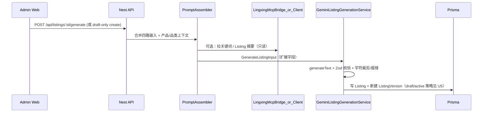

# W9–W10 Listing MVP（英语 / Amazon）

## Overview

在 W7/W8 领星只读数据与 MCP 工具就绪的基础上，交付 **S1 W9–W10 Listing MVP**：四路输入合并 → **Gemini 2.5 Pro** 生成英文 Amazon Listing → **状态流与版本子表**落地 → **管理端编辑器 UI** 可演示，并满足字符规则单元测试与双重唯一 / 主 Listing 约束。

本计划将工作拆为 **8 个实施单元（U1–U8）**，默认顺序执行；U1–U5 偏后端与规则，U6–U8 偏前端与端到端验证。（对齐主实施方案表格 §「W9–W10：Listing MVP」）

---

## Problem Frame

- **Prisma 域模型已存在**：`Listing`、`ListingVersion`、`ListingStatus`、`TrafficStrategy`、平台维度唯一与「每维度一条主 Listing」部分唯一索引已在库内。(see `apps/api/prisma/schema.prisma`)
- **缺口**：生成管线、`GeminiListingGenerationService.generateListing` 仍为 `NotImplementedException`；无 Listing 专用 Nest 模块与 IAM 策略落地；无符合 `D-listing-editor.md` 的前端。
- **约束**：AI 仅写入 **draft** 版本内容（P0 审计）；生成输出必须符合 Amazon EN 字符上限（主实施方案校验办法：**字符规则单元测试 100% CI 覆盖**）。

---

## Requirements Traceability

| 主实施方案条目                                                            | 本计划对应                  |
| ------------------------------------------------------------------------- | --------------------------- |
| 输入管道：竞品 URL + 人工卖点 + 品类词库 + 领星关键词                     | U1、U3                      |
| Listing 生成（Gemini 2.5 Pro EN）：Title/Bullets/Desc/A+/Backend Keywords | U3                          |
| 字符规则单元测试 100%                                                     | U2                          |
| 状态流 `draft → … → archived`；主 Listing 升降级审计                      | U4、U5                      |
| 双重唯一 + 每组合主 Listing 唯一                                          | U4（API 层校验 + 集成测试） |
| `traffic_strategy` 录入                                                   | U4、U6                      |
| ListingVersion：修改建新版本、active、历史回退                            | U5                          |
| Listing 编辑器前端（Tab、徽章、时间线、主 Listing、traffic_strategy）     | U6                          |
| 生成延迟 P95 &lt; 15s（M-02）                                             | U8（约定度量方式）          |

（origin: `docs/yaemartOS-implementation-plan.md` 表格）

---

## High-Level Technical Design

### 调用链（生成）



### 关键决策

1. **结构化输出**：遵循 ADR-005 — Vercel AI SDK + **Zod schema** 校验 `ListingContent`；生成后与 **U2 字符规则** 二次校验，不合格则返回可解析错误（不静默截断破坏语义处由 prompt 约束）。
2. **模型**：默认 **`GEMINI_PRO_MODEL`**（或配置项）指向 Gemini 2.5 Pro；Flash 仅用于轻量任务（与 ADR-005 分层一致）。
3. **IAM**：Casbin 对象 `listing`（或 ADR-006 示例中的 resource），动作含 `create/read/update/delete` + `approve`；与现有 `ListingEditor` / `ListingReviewer` 角色对齐。(see `docs/adr/ADR-006-iam-casbin.md`)
4. **领星关键词**：优先复用 W8 `LINGXING_ALLOWED_SHOP_IDS` 边界内的只读接口；输入合并失败时降级为空数组并记日志。

---

## Implementation Units

### U1 — 共享类型与输入模型扩展

**Goal**：扩展 `GenerateListingInput`，承载四路输入与规范化后的合并视图。

**Files（预期）**

- `packages/shared-types/src/index.ts`（或拆 `listing-generation.ts`）：扩展字段，例如：
  - `competitorUrls?: string[]`
  - `manualSellingPoints?: string`
  - `categoryLexicon?: string[]`（或引用品类模板 ID）
  - `lingxingKeywordSeed?: string[]`（来自 MCP/客户端）
- `apps/api/src/ai/interfaces/listing-generation.interface.ts`：同步类型引用

**Tests**：shared-types 编译通过；无需运行时测试。

**Scenarios**

- 最小输入（仅现有字段）仍可调用生成（向后兼容）。

---

### U2 — Amazon EN 字符规则（纯函数 + 100% 单元测试）

**Goal**：单一真相源，供生成后与 CI 使用；(see 主方案「字符规则单元测试 100% 覆盖」)

**Files（预期）**

- `apps/api/src/listing/rules/amazon-en-limits.ts`（常量：Title / Bullets / Desc / Search terms 等上限）
- `apps/api/src/listing/rules/validate-listing-content.ts`
- `apps/api/src/listing/rules/*.spec.ts` — **覆盖所有分支与边界**

**Tests**：`vitest` 全部断言具体上限数字与违规路径。

**Scenarios**

- 标题超限时校验失败或返回结构化 violations（与 U3 约定一致）。
- 每条 bullet、描述、search terms 独立计数规则正确。

---

### U3 — 实现 `GeminiListingGenerationService.generateListing`

**Goal**：替换 `NotImplementedException`，串联 Prompt（含四路合并摘要）、`generateText`、Zod、`U2` 校验。

**Files（预期）**

- `apps/api/src/ai/providers/gemini-listing-generation.service.ts`
- 可选：`apps/api/src/listing/prompts/assemble-listing-prompt.ts`
- `apps/api/src/ai/providers/gemini-listing-generation.service.spec.ts`（mock provider）

**Dependencies**：U1、U2；环境变量 `GEMINI_API_KEY`、`GEMINI_PRO_MODEL`。

**Scenarios**

- Mock AI 返回合法 JSON → 通过 Zod + U2。
- Mock 返回超长文本 → 校验失败并带明确错误码/消息。
- 无 API Key 时行为与现有 `helloWorld` 一致（可文档化 mock 路径）。

---

### U4 — `ListingModule`：CRUD、状态机、主 Listing、审计

**Goal**：REST API 管理 `Listing`；合法状态迁移；`isPrimary` 在同一 `(productId, brandId, marketId, platformId, shopId, language)` 下仅一条；`AuditService.logWrite`。

**Files（预期）**

- `apps/api/src/listing/`：`listing.module.ts`、`listing.controller.ts`、`listing.service.ts`、`dto/*`
- `apps/api/src/app.module.ts`：导入 `ListingModule`
- `apps/api/src/iam/*`：注册 `listing` 相关 policy 与 `KNOWN_OBJECTS`（若沿用现有模式）

**Tests**

- `listing.service.spec.ts`：状态迁移、主 listing 切换、跨品牌拒绝
- 集成测试或 e2e：创建第二条主 listing 应失败或自动取消旧主（行为需在服务层明确一种策略）

**Scenarios**

- `draft → review → approved → published` 允许路径；非法跳转拒绝。
- `platformId + shopId + platformListingId` 全局唯一冲突时 409。

---

### U5 — `ListingVersion`：写入版本、active 单一、回退

**Goal**：每次内容变更插入新版本；满足 DB 上「单列 active」部分唯一索引；支持激活某一历史版本（事务内归档旧 active）。

**Files（预期）**

- `listing-version.service.ts` 或与 `ListingService` 协作方法
- API：`PATCH .../version/:n/activate`、`GET .../versions`

**Tests**：版本号递增、唯一 `(listingId, versionNumber)`、同时仅一个 `active`。

**Scenarios**

- AI 生成写入 **draft 版本**；人工 promote 到 active 需权限（与 P0 一致）。

---

### U6 — Web：列表 + 编辑器骨架（对齐 D-listing-editor）

**Goal**：`apps/web` 侧路由与核心布局：版本时间线、内容 Tab、`traffic_strategy`、主 Listing 切换；调用 U4 API。

**Files（预期）**

- `apps/web/app/[locale]/(admin)/listings/`…（具体路径与现有 admin 一致）
- `apps/web/components/listing/*`
- `apps/web/messages/en.json`（及 es 如需占位）

**Tests**：可选组件测试；主验证在 U8 E2E。

**Scenarios**

- 未登录重定向/401；无权限显示禁用或 403。

---

### U7 — AI 面板接线与 Feature Flag

**Goal**：编辑器侧「生成 Listing」调用 U3 暴露的 HTTP 端点（可挂在 `AiController` 或 `ListingController`）；`FEATURE_LISTING_AI`（或统一 flags）灰度。

**Files（预期）**：web API client、`apps/api` 路由一层。

**Scenarios**

- Flag 关闭时隐藏生成按钮或显示说明。

---

### U8 — E2E + 性能验收占位

**Goal**：Playwright：登录用户对 listing 创建/生成/版本列表最小链路；记录生成接口耗时日志。

**Files（预期）**

- `tests/e2e/w9-w10-listing-mvp.spec.ts`
- `scripts/test-e2e-local.sh`：增加 `w9`/`w10`/`w9w10` 映射（与现有 week 映射风格一致）

**Scenarios**

- 未认证访问 listing API 返回 401。
- **k6**：主方案要求 P95；本单元产出 **脚本占位或 npm script**，完整压测可在 staging 执行（计划中注明）。

---

## Dependencies Between Units

```
U1 ──► U3 ──► U7
      ▲
U2 ───┘
U4 ──► U5 ──► U6 ──► U8
(U4 可与 U3 并行启动，但 UI 联调需 U3）
```

建议锁定顺序：**U1 → U2 → U3**，并行准备 **U4** schema/API 草图；**U5** 依赖 U4；前端 **U6–U7** 依赖 U4/U3；**U8** 最后。

---

## Risks & Mitigations

| 风险                                          | 缓解                                                                              |
| --------------------------------------------- | --------------------------------------------------------------------------------- |
| Gemini 长文本不稳定                           | Zod + U2 硬闸门；prompt 要求分段长度                                              |
| 竞品 URL 解析复杂                             | U1 可先存 URL 字符串，解析用占位或后续迭代                                        |
| 主 Listing 与版本 active 两套「活跃」概念混淆 | 文档与 API 命名区分：`isPrimary`（SKU 维度）vs `ListingVersion.status === active` |

---

## Explicitly Out of Scope（本切片不交付）

- **GLM-5**、FAQ/菜谱 AI（S2 W14）。
- **Walmart** 字符规则（S2 W16）。
- **ES 索引 Listing 草稿全文**（S1 W11 `ops-listing_draft`）。
- **A+ 富文本编辑器完整组件**：若工期紧，可用 markdown/纯文本占位 + 字符计数。

---

## Test & Verification Checklist（交付时）

- [ ] `pnpm --filter @yaemartos/api test` 含 U2 规则与 listing service 关键路径
- [ ] 字符规则测试覆盖率达标（CI 可设阈值）
- [ ] E2E w9/w10 spec 本地 green（`./scripts/test-e2e-local.sh w9w10`）
- [ ] 主实施方案表格中 W9–W10 **校验办法**列可在 PR 描述中逐条勾选

---

## References（repo-relative）

- `docs/yaemartOS-implementation-plan.md` — W9–W10 表格
- `docs/ui/D-listing-editor.md` — UI 结构
- `docs/adr/ADR-005-ai-services.md` — AI SDK + Zod
- `docs/adr/ADR-006-iam-casbin.md` — Listing 角色
- `apps/api/prisma/schema.prisma` — `Listing` / `ListingVersion`
- `apps/api/src/ai/providers/gemini-listing-generation.service.ts` — 当前占位
