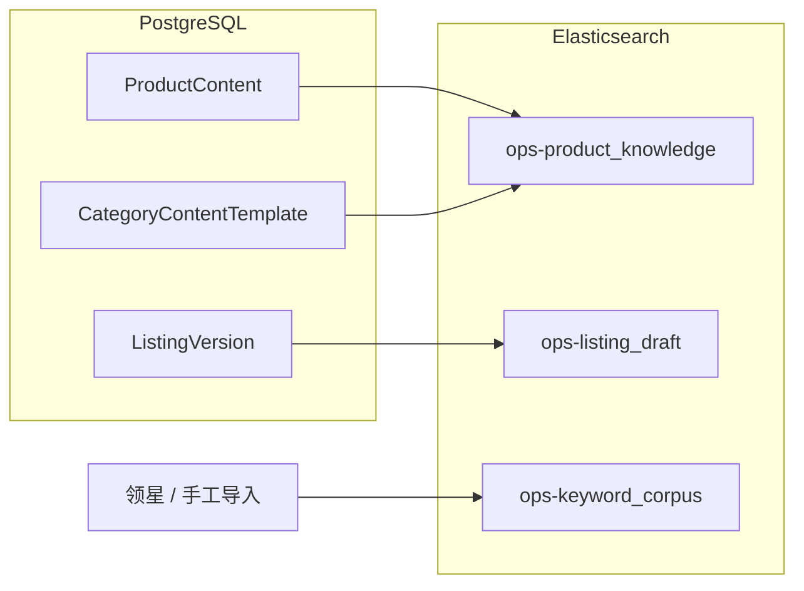

# W11：图片需求单 + ES 写入产品知识库

## Overview

在 W9–W10 Listing MVP 之后，按主实施方案 **W11** 交付三件事：**图片需求单模板**（设计可按单执行）、**产品/品类 FAQ/卖点等内容写入 Elasticsearch**（为 S3 客户中心与 RAG 做准备）、**Listing A/B 版本快照入索引**（可检索、可 diff）。索引命名与字段约定以 **ADR-003** 为准。(see origin: `docs/yaemartOS-implementation-plan.md` §W11)

---

## Problem Frame

- 当前 `SearchService` 仅提供 **单体索引** `yaemartos_products` 的 bootstrap/health（W4 占位），与 ADR-003 中的 **`ops-product_knowledge-{env}`**、**`ops-listing_draft-{env}`**、**`ops-keyword_corpus-{env}`** 尚未对齐。
- 图片需求单若无统一模板，设计与外包无法按同一规格交付。
- Listing 版本历史已在 PostgreSQL（`ListingVersion`）；W11 要把「可搜索快照 + A/B 对照」延伸到 ES，而非重复业务真相来源。

---

## Requirements Traceability

| 主实施方案 W11                                  | 本计划 |
| ----------------------------------------------- | ------ |
| 图片需求单模板（主图、场景图、A+、Infographic） | U2     |
| 产品内容/品类 FAQ/卖点写入 ES；延迟 &lt; 200ms  | U3、U6 |
| Listing A/B 版本快照；历史可查、可回退 diff     | U4     |

---

## High-Level Technical Design

### 索引职责（与 ADR-003 一致）

| Index                         | 用途                                                      |
| ----------------------------- | --------------------------------------------------------- |
| `ops-product_knowledge-{env}` | Category 模板 + Product 内容片段 + FAQ/卖点聚合检索       |
| `ops-listing_draft-{env}`     | Listing / ListingVersion 内容快照，支持全文与版本维度过滤 |
| `ops-keyword_corpus-{env}`    | 关键词词库（领星 + 运营补充），供生成与推荐               |

通用审计字段：`source_table`、`source_id`、`version`、`deleted_at` 等。(see `docs/adr/ADR-003-es-schema.md` §2.4)

### 数据流（示意）



---

## Implementation Units

### U1 — 索引基础设施：命名、bootstrap、mappings 骨架

**Goal**：从单一 `yaemartos_products` 演进为 **按 ADR 命名的多索引**；`env` 取自 `NODE_ENV` 或专用 `ES_INDEX_SUFFIX`（避免生产/dev 混写）。

**Files（预期）**

- `apps/api/src/search/`：抽取或扩展 `ElasticsearchIndexRegistry` / 常量 `OPS_PRODUCT_KNOWLEDGE`、`OPS_LISTING_DRAFT`、`OPS_KEYWORD_CORPUS`
- `apps/api/src/search/mappings/*.json` 或内联 TS 对象（与 ADR 多语言策略一致的可选简化版：先 **en-only text** 降低首版复杂度，在计划中标注后续 locale 扩展）

**Tests**：单元测试覆盖索引名拼接；无 ES 时 health/disabled 行为不变。

**Scenarios**

- `bootstrap` 可创建三个索引（dev 单 shard）；重复调用幂等。

---

### U2 — 图片需求单模板（交付物 + 可选结构化）

**Goal**：项目经理可按模板签收；研发侧可有 **JSON Schema** 或 Markdown frontmatter 方便后续表单化。

**Files（预期）**

- `docs/ui/` 或 `docs/templates/image-brief-v1.md`：四类素材（主图 / 场景图 / A+ / Infographic）的尺寸、格式、数量、文案栏位
- 可选：`packages/shared-types/src/image-brief.ts` — 与 Cloudinary ADR 尺寸约束交叉引用 (see `docs/adr/ADR-007-cloudinary.md`)

**Scenarios**

- 样例需求单一份可作为附件参照（计划中说明路径，不强制编码）。

---

### U3 — `ops-product_knowledge` 写入管线

**Goal**：Product / Category 模板 / FAQ 类内容变更时 **upsert** 文档；软删除同步 `deleted_at`。

**Files（预期）**

- `apps/api/src/search/product-knowledge-indexer.service.ts`
- 挂钩点：Product / Category 相关 **Service** 在 `create/update/delete` 成功后调用 indexer（或 Outbox 简化版：同步调用 + 失败日志，W11 可先同步）

**Tests**

- Mock ES client：`index`/`update`/`deleteByQuery` 调用参数符合 mapping。
- 集成测试（可选 docker ES）：单条写入后 `GET` 命中。

**Scenarios**

- 品类模板更新 → 对应 ES 文档 `version` 递增。
- 无 `ELASTICSEARCH_URL` 时 indexer no-op 且不阻断主事务。

---

### U4 — `ops-listing_draft`：ListingVersion 快照与 A/B 元数据

**Goal**：每次活跃版本变更或新建版本时，写入可检索快照；文档含 `listing_id`、`version_number`、`content_snapshot` 摘要字段（大字段策略：全文进 ES vs 仅存摘要——首版建议 **与 PG 快照一致的可搜索文本**，体积告警阈值写在代码常量）。

**Files（预期）**

- `listing-draft-indexer.service.ts`
- 由 `ListingService` / `ListingVersionService`（W9–W10）在提交版本后触发

**Scenarios**

- 同一 `listing_id` 两条版本文档可查询，`version_number` 过滤。
- **diff**：API 层可提供「取两版本 ES 文档或 PG 快照」的对比端点（若 W9 已有 PG diff，可复用 PG，ES 侧重搜索）。

---

### U5 — `ops-keyword_corpus`：词库导入与更新

**Goal**：从领星关键词工具/MCP 同步或 CSV 导入最小闭环；字段含 `brand_id`、`market`、`keyword`、`source`。

**Files（预期）**

- `keyword-corpus-indexer.service.ts` + 管理 API（或 CLI 脚本）首版二选一。

**Scenarios**

- 批量导入 1k 条词；重复导入幂等（以自然键 upsert）。

---

### U6 — 搜索 API 与 SLA 探测

**Goal**：对外提供 **只读** 搜索接口（管理端预览），满足「ES 延迟 &lt; 200ms」**抽样验证**（单元/集成记录耗时；完整 k6 可在 staging）。

**Files（预期）**

- `GET /api/search/knowledge?q=`（示例）+ Jwt + Casbin
- 性能：服务层记录 `duration_ms` 日志

**Scenarios**

- 空集群/无数据返回 200 + 空列表；延迟指标可观测。

---

### U7 — E2E、脚本与文档

**Goal**：Playwright 或 API 测试：bootstrap 索引、写入一条 fixture、搜索命中；`scripts/test-e2e-local.sh` 增加 `w11` 映射。

**Files（预期）**

- `tests/e2e/w11-es-knowledge.spec.ts`
- `scripts/test-e2e-local.sh`：`WEEK_MAP_w11=...`

---

## Dependencies Between Units

```
U1 → U3 → U6
U1 → U4 → U6
U1 → U5 → U6
U2 （可与 U1 并行，文档交付）
U7 最后
```

**与上游切片**：强依赖 W9–W10 的 Listing 写入路径（U4 挂钩）；若 W11 先行，需约定 **临时 cron 或手动 reindex** 补录。

---

## Risks & Mitigations

| 风险                                 | 缓解                                                   |
| ------------------------------------ | ------------------------------------------------------ |
| ES 文档过大                          | `content_snapshot` 拆字段或截断摘要 + PG 存全文        |
| 双写 PG+ES 不一致                    | 以 PG 为准；ES 重建脚本（reindex job）列入后续         |
| ADR 与现有 `yaemartos_products` 并存 | U1 明确迁移策略：保留旧索引仅 health，直至数据迁移完成 |

---

## Out of Scope（W11）

- 客户域 `customer-faq-{tenant}`（S3）
- 完整 Outbox/消息队列（可留 ADR 后续）
- 图片自动抠图/生成（仅需求单模板）

---

## Verification Checklist

- [ ] 三个 ops 索引可按 ADR 命名创建
- [ ] 产品知识写入 + 搜索延迟在本地/CI 可测（mock 或 ES 容器）
- [ ] Listing 版本至少 2 条快照可检索或等价 API 验证
- [ ] 图片需求单模板已评审路径（PM 签收记录可由团队线下完成，计划中保留 checklist 项）

---

## References（repo-relative）

- `docs/yaemartOS-implementation-plan.md` — §W11
- `docs/adr/ADR-003-es-schema.md` — 索引列表与字段
- `apps/api/src/search/search.service.ts` — 现状 bootstrap
- `docs/adr/ADR-007-cloudinary.md` — 图片规格交叉引用
