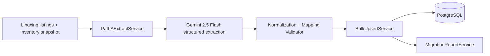

# W12：存量数据迁移（Homtone）

## Overview

在 W11 后进入 S1 最后一段业务导入，完成 **Homtone 美国 Amazon 在售 SKU 的路径 A 提取与入库**：领星 listing 数据 → Gemini 2.5 Flash 结构化提取 → `product` / `product_content` / `listing` 侧批量写入 → 产出迁移验收报告。目标对齐主实施方案：**准确率 ≥ M-07（95%）**，并形成可重复执行的导入流程。

---

## Problem Frame

- 当前已具备：W7/W8 领星只读与 MCP 能力、W9-W10 Listing MVP（计划中）、W11 ES 索引能力（计划中）。
- 缺失：没有「存量 listing 批量转结构化产品档案」的可复用导入流水线。
- 风险点：历史数据脏值、字段缺失、SKU/ASIN 一致性与重复冲突、AI 提取漂移。

---

## Requirements Traceability

| 主实施方案 W12 条目                                                | 本计划对应 |
| ------------------------------------------------------------------ | ---------- |
| 路径 A 提取（Gemini 2.5 Flash 结构化提取），仅 Homtone 美国 Amazon | U1、U2、U3 |
| 准确率 ≥ M-07（95%），运营逐条签字                                 | U5         |
| 批量导入脚本 + 验收报告，全量在售 SKU 入库                         | U4、U6     |

（see origin: `docs/yaemartOS-implementation-plan.md` §W12）

---

## High-Level Technical Design

### 关键决策

1. **导入范围硬限制**：仅 `brand=homtone`、`market=US`、`platform=amazon`（避免跨品牌污染）。
2. **提取结果强约束**：使用 Zod schema 做结构化输出校验，不合格记录进入失败队列，不直接写库。
3. **幂等导入**：以 `(brandId, sku)` 与 `(platformId, shopId, platformListingId)` 作为自然键进行 upsert。
4. **可回放**：每次导入生成 `run_id`，支持按 `run_id` 追溯与重试。

---

## Implementation Units

### U1 — 路径 A 提取 schema 与映射规则固化

**Goal**：把 `docs/lingxing-field-mapping.md` 转换为可执行的映射与校验规则。

**Files（预期）**

- `apps/api/src/migration/path-a/schema.ts`（Zod 提取结果）
- `apps/api/src/migration/path-a/mapping.ts`（领星字段 → 域模型字段）
- `apps/api/src/migration/path-a/types.ts`

**Scenarios**

- 缺字段/类型错位会被 schema 拦截，不进入写库阶段。

---

### U2 — `PathAExtractService`（Gemini 2.5 Flash）

**Goal**：实现结构化提取服务：输入领星 listing 原始 payload，输出规范化对象。

**Files（预期）**

- `apps/api/src/migration/path-a/path-a-extract.service.ts`
- `apps/api/src/migration/path-a/prompt.ts`
- `apps/api/src/migration/path-a/path-a-extract.service.spec.ts`

**Dependencies**：`GEMINI_API_KEY`、`GEMINI_FLASH_MODEL`、ADR-005 现有 AI SDK 模式。

**Scenarios**

- 正常 listing 文本返回结构化对象；
- 噪声输入返回可诊断错误并附原始样本引用 ID。

---

### U3 — 归一化与冲突处理

**Goal**：把提取结果转换为最终写库 DTO，处理冲突和默认值。

**Files（预期）**

- `apps/api/src/migration/path-a/normalize.ts`
- `apps/api/src/migration/path-a/conflict-rules.ts`
- `apps/api/src/migration/path-a/normalize.spec.ts`

**规则（示例）**

- 同一 SKU 多条记录：按 `lingxing_updated_at` 最新优先；
- 空标题/空 bullets：标记为 `needs_manual_review`，但允许保留导入草稿；
- `source` 统一标记 `erp_import`。

---

### U4 — 批量导入脚本与任务入口

**Goal**：实现可在本地/staging 执行的批量导入脚本，支持分页、断点续跑、失败重试。

**Files（预期）**

- `apps/api/src/migration/path-a/path-a-import.service.ts`
- `apps/api/src/migration/path-a/path-a-runner.ts`
- `scripts/migration/run-path-a-homtone.sh`

**Scenarios**

- 指定 `--from-page` / `--limit` 可续跑；
- 同一批次重复执行幂等（不重复创建业务实体）。

---

### U5 — 验收抽样与准确率统计（M-07）

**Goal**：输出可供运营逐条签字的抽样报告，统计准确率是否达到 95%。

**Files（预期）**

- `apps/api/src/migration/path-a/quality-metrics.ts`
- `scripts/migration/export-homtone-validation-report.ts`
- `docs/reports/w12-homtone-migration-validation-template.md`

**Scenarios**

- 按 SKU 导出「原始值 / 提取值 / 最终入库值」三列对照；
- 统计字段级准确率与记录级准确率。

---

### U6 — E2E/集成验证与回滚手册

**Goal**：保证迁移可验证、可回滚。

**Files（预期）**

- `tests/e2e/w12-homtone-path-a-migration.spec.ts`
- `docs/runbooks/w12-homtone-migration-runbook.md`

**Scenarios**

- 小样本（例如 20 条）全链路导入通过；
- 失败批次可按 `run_id` 清理或重放（回滚策略文档化）。

---

## Dependencies & Sequence

`U1 → U2 → U3 → U4 → U5 → U6`

- U4 依赖 U2/U3；
- U5 依赖 U4 产出的运行记录；
- U6 依赖 U4-U5 完整链路。

---

## Risks & Mitigations

| 风险                      | 缓解                                                     |
| ------------------------- | -------------------------------------------------------- |
| AI 提取漂移导致准确率不足 | 固化 few-shot + schema 校验 + 失败样本回灌               |
| 历史数据重复/脏值         | 导入前 normalization + 去重 + `needs_manual_review` 标记 |
| 大批量写入性能抖动        | 分页批量 upsert + 指数退避 + 运行节流参数                |
| 导入不可追溯              | 全链路 `run_id`、样本日志、报告归档                      |

---

## Out of Scope

- Spoonlemon / Walmart 迁移（S2 范围）；
- 完整自动化「运营签字」系统（本周仅导出验收报告模板 + 数据）；
- 实时双向回写领星（W12 仅单向导入）。

---

## Verification Checklist

- [ ] Homtone US Amazon 在售 SKU 全量导入完成；
- [ ] 字段映射与提取准确率 ≥ 95%（M-07）；
- [ ] 迁移报告可供运营逐条核验并签字；
- [ ] 导入脚本可重复执行且幂等；
- [ ] 小样本 E2E / 集成测试通过。

---

## References（repo-relative）

- `docs/yaemartOS-implementation-plan.md`
- `docs/lingxing-field-mapping.md`
- `docs/adr/ADR-004-lingxing-client.md`
- `docs/adr/ADR-005-ai-services.md`
