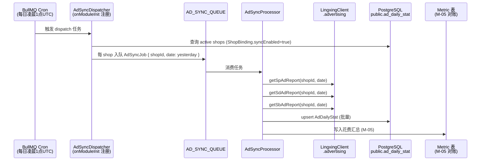

# feat: S4 W40-W42 广告数据看板

## Overview

将领星 ERP 的 Amazon SP/SD/SB 和 Walmart 广告报告拉取到本地全镜像表，通过 BullMQ 每日定时同步，并提供管理后台广告看板页面（日级报表 + 多维筛选）。覆盖实施方案 S4 W40-W42 的全部交付物，验收指标 M-05（广告花费同步误差 ≤ 0.1%）。

---

## Problem Frame

当前系统完成了 S3（W27-W39）：多语言 Listing 批量生成 + 客户中心 V1 全套。S4 第一阶段的核心目标是让运营人员能在 yaemartOS 内看到广告表现数据，而不必每日人工导出领星报表。

广告数据同步的挑战在于：

1. 领星广告 API 按店铺+日期维度返回，需要逐店铺分页拉取
2. 全镜像策略（§3.2）要求每日凌晨增量拉昨日数据，并对账验证误差满足 M-05
3. 现有 `LingxingClient` 没有广告操作，需要在 package 层扩展
4. 前端没有图表库，需新增并建立看板页面模式

---

## Requirements Trace

- R1. 广告报告同步：Amazon SP/SD/SB 和 Walmart 广告报告每日凌晨全镜像，误差满足 M-05（花费误差 ≤ 0.1%）
- R2. 本地存储：`AdDailyStat` 表存储每日+店铺+广告类型+活动维度的聚合指标（ACOS/花费/销售额/曝光/点击/转化订单数）
- R3. 看板 API：支持按品牌/市场/店铺/广告类型/日期范围筛选的聚合查询端点
- R4. 看板前端：日级趋势折线图 + 广告类型分布柱状图 + 汇总卡片，支持多维筛选
- R5. Feature Flag：`feature_flag.AD_SYNC` 控制同步开关，支持按品牌灰度；`feature_flag.AD_DASHBOARD` 控制前端可见性
- R6. 同步幂等性：重复执行同一天同一店铺的同步任务必须是幂等的（upsert 语义）

---

## Scope Boundaries

- 不含广告执行操作（创建/修改广告活动）：这是 W43-W45 的范围
- 不含 AI 广告优化建议单（GLM-5）：W43-W45 范围
- 不含关键词维度细粒度数据：R2 仅聚合到活动（Campaign）级别，关键词级别推迟到 W43+
- 不含广告数据历史回填（补拉历史 30/60/90 天）：首次同步只拉昨日；历史回填作为后续运维任务
- 不含实时广告数据推送（SSE/WebSocket）：看板为轮询或按需刷新

### Deferred to Follow-Up Work

- 关键词（Keyword）维度广告报告：S4 W43 扩展 `AdDailyStat` 或新增 `AdKeywordDailyStat`
- 广告数据历史回填脚本：数据迁移任务，上线后单独执行
- Dayparting（时段投放）配置：W46-W47 范围

---

## Context & Research

### Relevant Code and Patterns

- BullMQ Processor 模式：`apps/api/src/migration/path-a/path-a-import.processor.ts`（`@Processor` + `WorkerHost` + `job.updateProgress()`）
- BullMQ Module 注册：`apps/api/src/migration/migration.module.ts`（`BullModule.registerQueue({ name: QUEUE })`）
- BullMQ 全局连接：`apps/api/src/app.module.ts`（`BullModule.forRootAsync`，已配置 Redis）
- LingxingClient 操作类模式：`packages/lingxing-client/src/operations/listings.ts`（`withRetry` + `withCache` + `rateLimiter.acquire()`）
- LingxingClient 主类：`packages/lingxing-client/src/lingxing-client.ts`（操作类挂载 `this.xxx = new XxxOperations(...)`）
- Feature Flag 模式：`apps/api/src/common/feature-flag/feature-flag.service.ts`（查 `SystemConfig` 表，`category='feature_flag'`）
- Prisma `public` schema 扩展：`apps/api/prisma/schema.prisma`（新模型加 `@@schema("public")`）
- NestJS 模块结构：`apps/api/src/listing/`（Controller + Service + Module + DTO 标准布局）
- 前端 Server Component + API 调用模式：`apps/web/app/[locale]/(admin)/listings/`

### Institutional Learnings

- `docs/solutions/backend-patterns/nestjs-prisma-neon-multitenant-2026-04-30.md`：广告同步属于运营域（`public` schema），不走 tenant PrismaClient，直接注入 `PRISMA_PUBLIC` 即可
- `docs/solutions/integration-issues/lingxing-workspace-nest-e2e-breakage-2026-05-01.md`：LingxingClient 环境变量验证在 E2E 中需要在 CI `env:` 段显式传入
- `apps/api/src/migration/path-a/path-a-import.processor.ts`：分页拉取 + `job.updateProgress()` 的完整示例

### External References

- 领星广告报告 API 端点（实现时需与领星技术文档对齐）：约定格式 `/erp/sc/mws/ad/{type}/report`，精确路径在 U2 实现阶段确认
- BullMQ 定时重复任务：`Queue.add(name, data, { repeat: { pattern: '0 1 * * *' } })`（凌晨 1 点，UTC+8 为北京时间 09:00 前完成）
- recharts v2（React 18 兼容）：`pnpm add recharts`，`LineChart`/`BarChart` 组件

---

## Key Technical Decisions

- **同步触发机制**：引入 `@nestjs/schedule`（`pnpm --filter @yaemartos/api add @nestjs/schedule`），使用 `@Cron('0 2 * * *')` 装饰器触发 BullMQ 入队，比 BullMQ `repeat` 更可观测且符合 NestJS 惯用模式；`@nestjs/schedule` 当前未在 `apps/api/package.json` 中，需新增
- **数据粒度**：Campaign 级日报（`AdDailyStat`），不做关键词细粒度（推迟到 W43）；此决策支持 M-05 花费对账，覆盖率足够
- **Upsert 策略**：`prisma.adDailyStat.upsert({ where: { shopId_date_adType_campaignId }, update: {...}, create: {...} })`，天然幂等
- **广告类型枚举**：`sp | sd | sb | walmart_sp`，通过 Prisma enum `AdType` 强类型化，防止字符串错误
- **ACOS 计算**：不存 ACOS 值，在 API 层计算（`spend / sales * 100`），避免 `NaN`/`Infinity` 存入数据库
- **图表库**：recharts（MIT，React 18 兼容，`docs/ui/F-dashboard.md` 明确规划），作为前端第一个图表库引入；建立 `apps/web/components/charts/` 目录作为后续所有图表的共享模块
- **图表颜色**：所有图表颜色使用 CSS Custom Properties `var(--brand-primary)` 而非硬编码，与 `listing-matrix-dashboard.tsx` 的 `rgb(var(--brand-primary) / {opacity})` 模式保持一致（来自 AGENTS.md 品牌主题约束）
- **同步误差对账（M-05）**：每次同步完成后，将汇总花费写入 `Metric` 表（`name='ad.spend.{shopId}.{date}'`），供后续对账脚本 diff 领星原始值

---

## Open Questions

### Resolved During Planning

- **是否需要 `@nestjs/schedule`**：否，BullMQ `repeat` 原生支持 cron，不增加依赖
- **广告数据存 `public` schema 还是 tenant schema**：`public` schema（运营域），广告数据与品牌/店铺绑定，不属于用户隐私数据
- **ACOS 是否入库**：否，API 层计算，避免脏数据

### Deferred to Implementation

- **领星广告 API 的精确端点路径**：实现 `AdvertisingOperations` 前需查阅最新领星 OpenAPI 文档，路径可能为 `/erp/sc/mws/advertising/sp/report` 或其他格式
- **领星广告 API 的分页与字段结构**：实现时根据实际响应 schema 定义 `LingxingAdReportRaw` 类型
- **Walmart 广告是否走相同 API 端点**：领星对 Walmart 广告报告可能有独立 namespace，实现时确认

---

## High-Level Technical Design

> _以下展示各组件的依赖关系和数据流，是方向性指引，不是实现规范。_

---

## Implementation Units

- [ ] U1. **Prisma schema — AdDailyStat 广告日报镜像表**

**Goal:** 在 `public` schema 中添加 `AdDailyStat` 模型和 `AdType` 枚举，生成 migration

**Requirements:** R2, R6

**Dependencies:** None

**Files:**

- Modify: `apps/api/prisma/schema.prisma`
- Create: `apps/api/prisma/migrations/<timestamp>_add_ad_daily_stat/migration.sql`（由 `prisma migrate dev` 生成）
- Test: `apps/api/src/ad-sync/ad-sync.service.spec.ts`（U3 的测试文件，提前规划路径）

**Approach:**

- 新增 `AdType` enum：`sp | sd | sb | walmart_sp`，标注 `@@schema("public")`
- 新增 `AdDailyStat` 模型：字段包括 `id (cuid)`, `shopId`, `date (DateTime @db.Date)`, `adType (AdType)`, `campaignId`, `campaignName?`, `spend (Decimal 12,6)`, `sales (Decimal 12,6)`, `impressions (Int)`, `clicks (Int)`, `orders (Int)`, `syncedAt (DateTime)`, `createdAt`, `updatedAt`
- 唯一约束：`@@unique([shopId, date, adType, campaignId])`，支持 upsert 幂等
- 索引：`@@index([shopId, date])`（看板按店铺日期查询），`@@index([date])`（全局日期范围查询）
- 外键：`shopId` 关联 `Shop.id`（`onDelete: Cascade`）；`@@schema("public")`

**Patterns to follow:**

- `AiCallLog`/`Metric` 模型（同为 public schema 聚合数据，使用 `Decimal` + 索引模式）

**Test scenarios:**

- Test expectation: none — 纯 schema + migration，行为通过 U3 服务测试覆盖

**Verification:**

- `prisma migrate dev` 成功，生成迁移文件
- `prisma generate` 无 TypeScript 错误
- `SELECT * FROM public.ad_daily_stat LIMIT 1` 可执行（curl/psql 验证）

---

- [ ] U2. **LingxingClient — AdvertisingOperations 广告操作类**

**Goal:** 在 `@yaemartos/lingxing-client` package 中添加广告报告拉取操作，并挂载到 `LingxingClient`

**Requirements:** R1

**Dependencies:** None（可与 U1 并行）

**Files:**

- Create: `packages/lingxing-client/src/operations/advertising.ts`
- Create: `packages/lingxing-client/src/types/advertising.types.ts`
- Modify: `packages/lingxing-client/src/lingxing-client.ts`（挂载 `this.advertising`）
- Modify: `packages/lingxing-client/src/index.ts`（导出 `AdvertisingOperations` 和类型）
- Test: `packages/lingxing-client/src/operations/advertising.spec.ts`

**Approach:**

- `advertising.types.ts`：定义 `LingxingAdReportRaw`（待实现时对齐领星实际响应字段），`MappedAdReport`（统一 camelCase 格式），`AdReportFetchResult`
- `AdvertisingOperations` 类：构造函数接收 `(transport, rateLimiter)`，与 `OrdersOperations` 相同（无 cache，广告报告非热点数据）
- 方法：`getSpCampaignReport(shopId, date, options)`, `getSdCampaignReport(shopId, date, options)`, `getSbCampaignReport(shopId, date, options)`, `getWalmartCampaignReport(shopId, date, options)`
- 每个方法内用 `withRetry`（最多 3 次）+ `rateLimiter.acquire()`，模式与 `OrdersOperations` 一致
- 精确 API endpoint 路径在实现时查阅领星文档；类型定义提前占位，字段名以 `_raw` 后缀标注待对齐
- `LingxingClient` 中加 `public readonly advertising: AdvertisingOperations;`

**Patterns to follow:**

- `packages/lingxing-client/src/operations/orders.ts`（无 cache 的操作类模式）
- `packages/lingxing-client/src/types/listing.types.ts`（Raw → Mapped 类型对）

**Test scenarios:**

- Happy path：`getSpCampaignReport('shop-1', new Date('2026-05-03'))` 调用 transport.request，返回 MappedAdReport[]
- Edge case：API 返回空数组时，返回 `[]` 而非抛异常
- Error path：transport 抛 `NetworkError` 时，`withRetry` 最多重试 3 次后抛出
- Error path：`RateLimitedError` 时，`rateLimiter.acquire()` 等待令牌，不立即抛出

**Verification:**

- `pnpm --filter @yaemartos/lingxing-client typecheck` 无错误
- `pnpm --filter @yaemartos/lingxing-client test` 全部通过
- `LingxingClient` 实例可访问 `client.advertising.getSpCampaignReport`

---

- [ ] U3. **BullMQ 广告同步模块 — 每日定时拉取 + 幂等 upsert**

**Goal:** 实现 `AdSyncModule`，包含调度器（每日 BullMQ cron）、Processor 和 Service，将领星广告数据 upsert 到 `AdDailyStat`

**Requirements:** R1, R2, R5, R6

**Dependencies:** U1, U2

**Files:**

- Create: `apps/api/src/ad-sync/ad-sync.job.ts`（队列常量 + job payload 类型）
- Create: `apps/api/src/ad-sync/ad-sync.service.ts`
- Create: `apps/api/src/ad-sync/ad-sync.processor.ts`
- Create: `apps/api/src/ad-sync/ad-sync.module.ts`
- Modify: `apps/api/src/app.module.ts`（导入 `AdSyncModule` 和 `ScheduleModule.forRoot()`）
- Test: `apps/api/src/ad-sync/ad-sync.service.spec.ts`

**Approach:**

- `ad-sync.job.ts`：`AD_SYNC_QUEUE = 'ad-sync'`，`AD_DISPATCH_JOB = 'ad-sync:dispatch'`，`AD_SHOP_JOB = 'ad-sync:shop'`；`AdShopSyncPayload { shopId, brandId, date: string }`
- `AdSyncModule.onModuleInit()`：调用 `dispatchQueue.add(AD_DISPATCH_JOB, {}, { repeat: { pattern: '0 1 * * *', utcOffset: 0 }, jobId: 'daily-dispatch' })`，幂等（jobId 固定防止重复注册）
- `AdSyncProcessor`：处理 `AD_DISPATCH_JOB`：查询所有 `ShopBinding.syncEnabled=true` 的店铺，检查 feature flag `feature_flag.AD_SYNC`，每个店铺入队 `AD_SHOP_JOB { shopId, brandId, date }`；处理 `AD_SHOP_JOB`：调用 `AdSyncService.syncShopDate(shopId, brandId, date)`
- `AdSyncService.syncShopDate`：拉取 SP/SD/SB/Walmart 四种广告类型，批量 `prismaPublic.adDailyStat.upsert()`，写 `Metric` 汇总（`ad.spend.{shopId}.{date}` = 总花费）；`shop.platform.code` 为 `walmart` 时跳过 SP/SD/SB，只拉 `walmart_sp`
- 错误处理：单个广告类型拉取失败不中断其他类型；记录 `Logger.warn`；整体失败让 BullMQ 自动重试（`attempts: 3`）

**Patterns to follow:**

- `apps/api/src/migration/path-a/path-a-import.processor.ts`（Processor + Service 分离）
- `apps/api/src/migration/migration.module.ts`（`BullModule.registerQueue`）
- `apps/api/src/common/feature-flag/feature-flag.service.ts`（feature flag 检查）

**Test scenarios:**

- Happy path（Service）：`syncShopDate('shop-1', 'homtone', '2026-05-03')` → 调用 `advertising.getSpCampaignReport`，upsert `AdDailyStat`，写 `Metric`
- Edge case：`getSpCampaignReport` 返回空数组 → 跳过 upsert，不报错
- Error path：`getSdCampaignReport` 抛异常 → 其他类型继续执行，返回 `{ sp: ok, sd: error, sb: ok }`
- Edge case：Walmart 店铺只调用 `getWalmartCampaignReport`，不调用 SP/SD/SB
- Integration：Processor 处理 `AD_DISPATCH_JOB` 时，查到 2 个 active shop → 入队 2 个 `AD_SHOP_JOB`（mock BullMQ Queue）

**Verification:**

- `pnpm --filter @yaemartos/api test` 通过
- 手动触发 `AD_DISPATCH_JOB`（开发环境通过 Bull Board 或直接 `queue.add()`）后，`adDailyStat` 表有数据写入
- `Metric` 表有 `ad.spend.*` 记录

---

- [ ] U4. **NestJS API — 广告看板查询端点**

**Goal:** 提供 `GET /ads/dashboard` 端点，支持多维筛选，返回日级聚合数据供前端图表使用

**Requirements:** R3

**Dependencies:** U1, U3（需要有数据）

**Files:**

- Create: `apps/api/src/ad-dashboard/ad-dashboard.controller.ts`
- Create: `apps/api/src/ad-dashboard/ad-dashboard.service.ts`
- Create: `apps/api/src/ad-dashboard/dto/ad-dashboard-query.dto.ts`
- Create: `apps/api/src/ad-dashboard/ad-dashboard.module.ts`
- Modify: `apps/api/src/app.module.ts`（导入 `AdDashboardModule`）
- Test: `apps/api/src/ad-dashboard/ad-dashboard.service.spec.ts`

**Approach:**

- DTO：`AdDashboardQueryDto { brandId?: string, shopId?: string, adType?: AdType, startDate: string (ISO date), endDate: string (ISO date) }`，用 `class-validator` 校验日期格式和范围（最多 90 天）
- Service：`queryDashboard(dto)` → `prismaPublic.adDailyStat.groupBy({ by: ['date', 'adType'], where: { date: { gte, lte }, ...filters }, _sum: { spend, sales, impressions, clicks, orders } })`；返回 `{ daily: DailyBucket[], totals: Totals, acos: number }`
- ACOS 在 service 层计算：`totals.sales > 0 ? totals.spend / totals.sales * 100 : null`
- Controller：`@Get('dashboard') @UseGuards(JwtAuthGuard)` + IAM 检查（确保 user 有权限看该 brandId 数据）
- Feature flag 检查：若 `feature_flag.AD_DASHBOARD` 为 false，返回 `403 Feature not enabled`
- 响应类型定义在 `packages/shared-types/src/index.ts` 中导出，供前端使用

**Patterns to follow:**

- `apps/api/src/listing/listing.controller.ts`（JwtAuthGuard + IAM guard 组合）
- `apps/api/src/listing/listing.service.ts`（prismaPublic 注入 + 查询聚合）

**Test scenarios:**

- Happy path：`queryDashboard({ brandId: 'homtone', startDate: '2026-05-01', endDate: '2026-05-03' })` → 返回 3 个 DailyBucket + totals
- Edge case：日期范围内无数据 → 返回 `{ daily: [], totals: { spend: 0, ... }, acos: null }`
- Error path：`endDate - startDate > 90 天` → DTO 验证失败，返回 400
- Error path：user brandId 与查询 brandId 不匹配 → 403
- Edge case：`totals.sales = 0` → `acos = null`（不返回 `Infinity`）

**Verification:**

- `curl GET /ads/dashboard?brandId=homtone&startDate=2026-05-01&endDate=2026-05-03` 返回 200 + 正确 JSON
- 无权限 token 返回 403
- 超范围日期返回 400

---

- [ ] U5. **前端广告看板页面**

**Goal:** 在管理后台新增广告看板页面，含折线图趋势、柱状图分布、汇总卡片和筛选栏

**Requirements:** R4, R5

**Dependencies:** U4

**Files:**

- Create: `apps/web/app/[locale]/(admin)/ads/dashboard/page.tsx`（Server Component）
- Create: `apps/web/app/[locale]/(admin)/ads/dashboard/ad-dashboard-client.tsx`（Client Component，图表）
- Create: `apps/web/components/charts/line-chart.tsx`（通用折线图封装）
- Create: `apps/web/components/charts/bar-chart.tsx`（通用柱状图封装）
- Create: `apps/web/lib/api/ad-dashboard-client.ts`（API fetch 函数）
- Modify: `apps/web/package.json`（`pnpm add recharts`）
- Modify: 侧边栏导航（添加"广告看板"入口，具体文件路径为 admin sidebar component）

**Approach:**

- Server Component（`page.tsx`）：解析 `searchParams`（brandId, shopId, adType, startDate, endDate），调用 `fetchAdDashboard(params)`，传给 `AdDashboardClient`；`startDate/endDate` 默认最近 7 天
- Client Component（`ad-dashboard-client.tsx`）：
  - 汇总卡片：总花费 / 总销售额 / ACOS / 总点击数（`MetricCard` 组件）
  - 趋势折线图：Y 轴双轴（左：花费/销售额；右：ACOS%），X 轴为日期
  - 广告类型柱状图：按 adType 分组的花费对比
  - 筛选栏（Client-side）：日期范围选择器 + adType 多选；筛选后使用 `router.push` 更新 searchParams 触发 Server Component 重新 fetch
- Feature flag 检查：若后端返回 403，前端显示"功能未开启"占位
- recharts 组件包裹在 `apps/web/components/charts/` 中，确保 recharts 不直接散落在页面文件里

**Patterns to follow:**

- `apps/web/app/[locale]/(admin)/listings/[id]/page.tsx`（Server Component + Client Component 分层）
- `apps/web/lib/api/listing-client.ts`（API fetch 函数模式）

**Test scenarios:**

- Happy path：`page.tsx` 渲染时传入有效 searchParams → `fetchAdDashboard` 被调用，`AdDashboardClient` 收到 data prop
- Edge case：searchParams 无日期参数 → 默认最近 7 天
- Edge case：API 返回空数据（无广告） → 图表显示"暂无数据"占位符，不报 JS 错误
- Edge case：feature flag 关闭（403） → 显示功能未开启提示，不崩溃

**Verification:**

- 本地 dev 可访问 `/en/ads/dashboard`，正常渲染（即便数据为空）
- recharts 图表在开发模式无 SSR 报错（确认 recharts 只在 Client Component 中 import）
- 侧边栏"广告看板"链接可点击跳转

---

## System-Wide Impact

- **Interaction graph**: `AdSyncModule` 在 `AppModule` 初始化时注册 BullMQ cron，影响应用启动时序；`LingxingClientModule` 已全局注册，`AdSyncProcessor` 可直接注入 `LingxingClient`
- **Error propagation**: BullMQ processor 抛出异常会进入 BullMQ 内置重试队列（`attempts: 3`），不影响 HTTP 请求路径；`AdDashboardService` 查询失败直接向上传 500
- **State lifecycle risks**: `AdDailyStat` upsert 的唯一键为 `(shopId, date, adType, campaignId)`；如果领星 campaignId 在日期内改变（极罕见），可能出现新旧记录共存，需留意
- **API surface parity**: 新增 MCP 工具描述符 `getAdDashboard` 应同步到 `apps/api/src/ai/tools/yaemartos-tools.ts`（Agent-Native 原则）
- **Integration coverage**: 需 E2E 验证：BullMQ cron 触发 → Processor 执行 → `AdDailyStat` 写入 → API 返回 → 前端渲染链路
- **Unchanged invariants**: `LingxingClient` 现有 `listings/inventory/shops/orders` 操作不受影响；Prisma `public` schema 现有模型不变

---

## Risks & Dependencies

| Risk                                               | Mitigation                                                                                                                         |
| -------------------------------------------------- | ---------------------------------------------------------------------------------------------------------------------------------- |
| 领星广告 API 端点路径未知                          | U2 实现前查阅最新领星 OpenAPI 文档；端点格式参考 `/erp/sc/mws/ad/{sp\|sd\|sb}/report`；如不存在则以空实现 mock 推进 U3/U4/U5       |
| 领星广告 API 响应字段变更                          | `LingxingAdReportRaw` 类型保持宽松（`[key: string]: unknown`），映射层做安全取值                                                   |
| recharts 与 Next.js 14 Server Component 冲突       | recharts 只在 `'use client'` 组件中 import；Server Component 不直接引用                                                            |
| BullMQ cron 在多实例部署时重复触发                 | BullMQ 使用 Redis 分布式锁保证同一时刻只有一个 worker 执行（已是 BullMQ 默认行为）                                                 |
| `AdDailyStat` 数据量增长（每日 × 店铺数 × 活动数） | 已添加 `(shopId, date)` 索引；预计 2 品牌 × 5 店铺 × 100 活动 × 365 天 ≈ 36 万行，PostgreSQL 可轻松应对；S5 前评估是否需要按年分区 |

---

## Documentation / Operational Notes

- 首次上线后需手动触发历史回填（补拉最近 30 天），方式：直接 `queue.add(AD_SHOP_JOB, { shopId, date })` 30 次，或写一次性脚本
- `feature_flag.AD_SYNC` 默认 `false`，上线前在 `SystemConfig` 插入开关记录，灰度到 homtone 先验证
- M-05 对账脚本（暂手动）：查询 `Metric` 表中 `ad.spend.*`，与领星后台导出花费对比
- 新增环境变量：无（领星已配置）；如添加 recharts 无需新 env

---

## Sources & References

- 实施方案 S4 W40-W42：`docs/yaemartOS-implementation-plan.md` §9（W40-W42）
- BullMQ Processor 模式：`apps/api/src/migration/path-a/path-a-import.processor.ts`
- LingxingClient 扩展参照：`packages/lingxing-client/src/operations/orders.ts`
- Prisma schema 参照：`apps/api/prisma/schema.prisma`
- Feature Flag 服务：`apps/api/src/common/feature-flag/feature-flag.service.ts`
- 验收指标 M-05：`docs/yaemartOS-implementation-plan.md` §5（量化验收基线）
