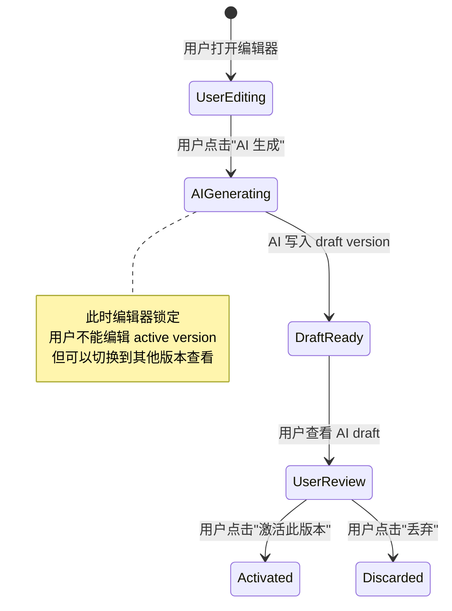

# yaemartOS Listing Editor + AI 协作 UI 设计

> 落地切片：S1 W9-W10（Listing MVP）+ S1 W11（AI 提示气泡）  
> 对标：Linear Issue Detail（左右分栏）+ Notion Page History（版本时间线）+ GitHub PR diff  
> 关联审计：P0-5（Agent 只能写 draft version）/ P0-3（AI 能力展示）

---

## 1. 整体布局

```
┌──────────────────────────────────────────────────────────────────────┐
│ TopNav: [← Back to List] [Listing: PRD-001 6QT Slow Cooker]  [Save▾]│
├─────────┬────────────────────────────────────────────┬───────────────┤
│ VERSION │              CONTENT EDITOR                 │  AI COPILOT   │
│ TIMELINE│                                            │               │
│         │ ┌─────────────────────────────────────────┐│ ┌───────────┐ │
│ v3 ○ AI │ │ [Title] [Bullets] [Desc] [A+] [Keywords]││ │ Sparkles  │ │
│   draft │ │                                         ││ │           │ │
│         │ │  Title (152/200)                        ││ │ "Optimize │ │
│ v2 ○    │ │  ┌─────────────────────────────────┐   ││ │  this     │ │
│   review│ │  │ Homtone 6QT Programmable Slow   │   ││ │  title?"  │ │
│         │ │  │ Cooker with Digital Timer...     │   ││ │           │ │
│ v1 ●    │ │  └─────────────────────────────────┘   ││ │ ───────── │ │
│   active│ │                                         ││ │           │ │
│         │ │  Bullet 1 (312/500)                     ││ │ [Generate │ │
│         │ │  ┌─────────────────────────────────┐   ││ │  Full     │ │
│         │ │  │ LARGE CAPACITY - Perfect for    │   ││ │  Listing] │ │
│         │ │  │ families of 4-6...              │   ││ │           │ │
│         │ │  └─────────────────────────────────┘   ││ │ [Optimize │ │
│         │ │  ...                                    ││ │  Keywords]│ │
│         │ │                                         ││ │           │ │
├─────────┤ │  [traffic_strategy: primary ▾]          ││ │ [Compare  │ │
│ Actions │ │  [★ Primary Listing]                    ││ │  w/ v1]   │ │
│ ──────  │ │                                         ││ │           │ │
│ [Diff]  │ └─────────────────────────────────────────┘│ └───────────┘ │
│ [Revert]│                                            │               │
│ [Delete]│  Status: draft → review → approved → ...   │               │
└─────────┴────────────────────────────────────────────┴───────────────┘
```

**布局比例**：左 180px 固定 + 中 flex-1 + 右 280px 可折叠

---

## 2. 版本时间线

### 2.1 版本条目设计

```
┌─────────────────────────┐
│ ● v1  Active            │  ← green-600 dot + "Active" badge
│   Apr 15, 10:30 AM      │
│   by: @operator-wang     │
│   source: manual         │
├─────────────────────────┤
│ ○ v2  In Review         │  ← yellow-500 dot + "Review" badge
│   Apr 20, 2:15 PM       │
│   by: @operator-li       │
│   source: manual         │
├─────────────────────────┤
│ ○ v3  AI Draft          │  ← violet-500 dot + "AI Draft" badge
│   Apr 22, 9:00 AM       │
│   by: AI (Gemini Pro)    │
│   source: ai_generated   │
│   ┌───────────────┐     │
│   │ ⚡ Review this │     │
│   └───────────────┘     │
└─────────────────────────┘
```

### 2.2 状态徽章配色

| 状态      | 颜色          | Badge Class                       |
| --------- | ------------- | --------------------------------- |
| Active    | `emerald-600` | `bg-emerald-100 text-emerald-700` |
| Draft     | `slate-500`   | `bg-slate-100 text-slate-600`     |
| AI Draft  | `violet-500`  | `bg-violet-100 text-violet-700`   |
| In Review | `amber-500`   | `bg-amber-100 text-amber-700`     |
| Archived  | `zinc-400`    | `bg-zinc-100 text-zinc-500`       |

### 2.3 Diff 对比视图

```
┌─────────────────────────────────────────────────┐
│  Comparing: v1 (Active) ↔ v3 (AI Draft)        │
│  ┌────────────────────┬────────────────────┐    │
│  │ v1                 │ v3 (AI)            │    │
│  ├────────────────────┼────────────────────┤    │
│  │ Title:             │ Title:             │    │
│  │ Homtone 6QT Slow   │ Homtone 6QT       │    │
│  │ Cooker [-with      │ [-Programmable-]   │    │
│  │ Digital Timer-]    │ Slow Cooker with   │    │
│  │                    │ [+Smart Timer &    │    │
│  │                    │ Auto Keep Warm+]   │    │
│  └────────────────────┴────────────────────┘    │
│                                                  │
│  [← Back]  [Accept v3]  [Cherry-pick fields]    │
└─────────────────────────────────────────────────┘
```

删除线红色、新增绿色（同 GitHub diff 习惯）。

---

## 3. Agent ↔ 用户协作冲突规则（审计 P0-5 修复）

### 3.1 核心约束



### 3.2 协作锁定 UI

**AI 生成进行中（编辑器锁定态）**：

```
┌─────────────────────────────────────────────────────┐
│                                                      │
│   ┌─── 半透明遮罩 (opacity-50) ────────────────┐   │
│   │                                              │   │
│   │         ✨ AI is generating v3...            │   │
│   │         ████████████░░░░░░░░  65%           │   │
│   │                                              │   │
│   │         Generating bullets (3/5)             │   │
│   │                                              │   │
│   │         [Cancel Generation]                  │   │
│   │                                              │   │
│   └──────────────────────────────────────────────┘   │
│                                                      │
└─────────────────────────────────────────────────────┘
```

### 3.3 规则清单

| 规则                               | UI 表现                                                   | 技术实现                               |
| ---------------------------------- | --------------------------------------------------------- | -------------------------------------- |
| AI 写入 **只能进入 draft version** | 时间线新增条目标记 "AI Draft"                             | API 强制 `version.status = 'draft'`    |
| 用户激活 draft 前 AI 不能改 active | active 版本无 AI 操作按钮                                 | 后端校验 `version.status !== 'active'` |
| AI 生成时锁定编辑器                | 半透明遮罩 + 进度条 + Cancel                              | WebSocket 状态 `isGenerating`          |
| Cancel 后 AI draft 保留为未完成    | 时间线标记 "⚠️ Incomplete"                                | `version.status = 'draft_incomplete'`  |
| 用户激活其他版本                   | Toast: "v2 is now active. Previous active (v1) archived." | 后端事务更新                           |

### 3.4 组件骨架

```tsx
function ListingEditor({ listingId }: { listingId: string }) {
  const { versions, activeVersion, isGenerating } = useListingVersions(listingId);
  const [selectedVersion, setSelectedVersion] = useState(activeVersion);

  return (
    <div className="flex h-full">
      {/* Left: Version Timeline */}
      <aside className="w-[180px] border-r overflow-y-auto">
        <VersionTimeline
          versions={versions}
          selected={selectedVersion}
          onSelect={setSelectedVersion}
        />
      </aside>

      {/* Center: Content Editor */}
      <main className="flex-1 relative overflow-y-auto p-6">
        {isGenerating && (
          <GeneratingOverlay progress={generationProgress} onCancel={cancelGeneration} />
        )}
        <ContentEditor
          version={selectedVersion}
          disabled={isGenerating || selectedVersion.status === 'active'}
          platformRules={platformRules}
        />
      </main>

      {/* Right: AI Copilot Panel */}
      <aside className="w-[280px] border-l p-4">
        <AiCopilotPanel
          listingId={listingId}
          currentVersion={selectedVersion}
          onGenerate={startGeneration}
          disabled={isGenerating}
        />
      </aside>
    </div>
  );
}
```

---

## 4. AI 提示气泡（Capability Discovery）

### 4.1 触发规则

| 条件                         | 气泡内容                                          | 位置               |
| ---------------------------- | ------------------------------------------------- | ------------------ |
| Title 字数 < 80              | "✨ AI can help optimize your title for SEO"      | Title 输入框右下   |
| 3+ Bullets 为空              | "✨ Generate all bullets from product attributes" | Bullets Tab 顶部   |
| Backend Keywords 为空        | "✨ AI can suggest high-relevance keywords"       | Keywords Tab       |
| A+ 完全为空                  | "✨ Generate A+ content from product images"      | A+ Tab             |
| 字符超限                     | "✨ AI can shorten this while keeping key info"   | 超限字段旁         |
| 编辑器首次打开（onboarding） | "💡 Tip: Press Cmd+G to generate with AI"         | 中央浮层（一次性） |

### 4.2 气泡组件

```tsx
function AiHintBubble({ message, action, onDismiss }: AiHintProps) {
  return (
    <div
      role="tooltip"
      aria-label={message}
      className="absolute -right-2 top-full mt-1 z-[60]
                 bg-violet-50 border border-violet-200 rounded-lg p-3
                 shadow-md max-w-[220px] animate-in fade-in slide-in-from-top-1"
    >
      <p className="text-sm text-violet-700">{message}</p>
      <div className="flex gap-2 mt-2">
        <Button size="xs" variant="ghost" onClick={onDismiss}>
          Dismiss
        </Button>
        <Button size="xs" className="bg-violet-600 text-white" onClick={action.onClick}>
          <Sparkles className="w-3 h-3 mr-1" /> {action.label}
        </Button>
      </div>
    </div>
  );
}
```

---

## 5. traffic_strategy 标签 + 主 Listing 切换

### 5.1 战术意图视觉编码

| Strategy       | 图标           | 颜色          | Badge                             |
| -------------- | -------------- | ------------- | --------------------------------- |
| `primary`      | `Star`         | `amber-600`   | `bg-amber-100 text-amber-700`     |
| `variant`      | `GitBranch`    | `blue-500`    | `bg-blue-100 text-blue-700`       |
| `bundle`       | `Package`      | `purple-500`  | `bg-purple-100 text-purple-700`   |
| `keyword_grab` | `Target`       | `rose-500`    | `bg-rose-100 text-rose-700`       |
| `seasonal`     | `Calendar`     | `emerald-500` | `bg-emerald-100 text-emerald-700` |
| `cohort_test`  | `FlaskConical` | `cyan-500`    | `bg-cyan-100 text-cyan-700`       |

### 5.2 主 Listing 切换二次确认

```
┌───────────────────────────────────────────┐
│  ⚠️ Change Primary Listing?               │
│                                           │
│  You are about to set this listing as     │
│  the primary for:                         │
│                                           │
│  Product: 6QT Slow Cooker                 │
│  Market:  US                              │
│  Platform: Amazon                         │
│  Shop:    Homtone-Main                    │
│                                           │
│  Current primary (ASIN: B0CXXX123)        │
│  will be downgraded to "variant".         │
│                                           │
│  This action is logged and auditable.     │
│                                           │
│  [Cancel]              [Confirm Change]   │
└───────────────────────────────────────────┘
```

---

## 6. 状态流可视化

```
  draft ──→ review ──→ approved ──→ published ──→ paused
    │          │           │            │           │
    │          │           │            └───────────┤
    │          │           │                        │
    └──────────┴───────────┴────────────────────────┴──→ archived

    ┌─────┐  ┌─────┐  ┌─────┐  ┌─────┐  ┌─────┐  ┌─────┐
    │Draft│→ │Review│→ │Appvd│→ │ Pub │→ │Pause│  │Archv│
    │ ○   │  │ ◐   │  │ ◑   │  │ ●   │  │ ◎   │  │ ×   │
    └─────┘  └─────┘  └─────┘  └─────┘  └─────┘  └─────┘
    slate     amber    blue      green    orange    zinc
```

**UI 实现**：水平 Stepper 组件，当前状态高亮 + 圆点填充动画。

---

## 7. 平台字符规则实时反馈

```tsx
function CharCounter({ current, max, fieldName }: CharCounterProps) {
  const percentage = current / max;
  const isOver = current > max;
  const isNear = percentage > 0.85 && !isOver;

  return (
    <span
      className={cn(
        'text-xs tabular-nums',
        isOver && 'text-red-600 font-medium',
        isNear && 'text-amber-600',
        !isOver && !isNear && 'text-zinc-400',
      )}
    >
      {current}/{max}
    </span>
  );
}
```

在每个字段输入框**右上角**显示，不占行高。超限时输入框 `border-red-500` + shake 动画。

---

## 8. Don'ts（反面例子）

| ❌ 不要做              | ✅ 替代做法                   | 原因                                 |
| ---------------------- | ----------------------------- | ------------------------------------ |
| AI 生成完自动激活版本  | AI 只写 draft，用户手动激活   | 防止 AI 覆盖运营已确认的 active 内容 |
| 隐藏版本历史只显示最新 | 永远展示完整时间线            | 运营需要回退、对比、审计             |
| 字符超限时阻止输入     | 允许输入但红色警告 + 禁用提交 | 超限时运营需要看完整内容再删减       |

---

## 9. shadcn/ui 组件清单（本页面）

`Tabs` / `Badge` / `Button` / `Dialog` / `ScrollArea` / `Tooltip` / `Progress` / `Separator` / `Input` / `Textarea` / `Select` / `Toast` / `Card`
