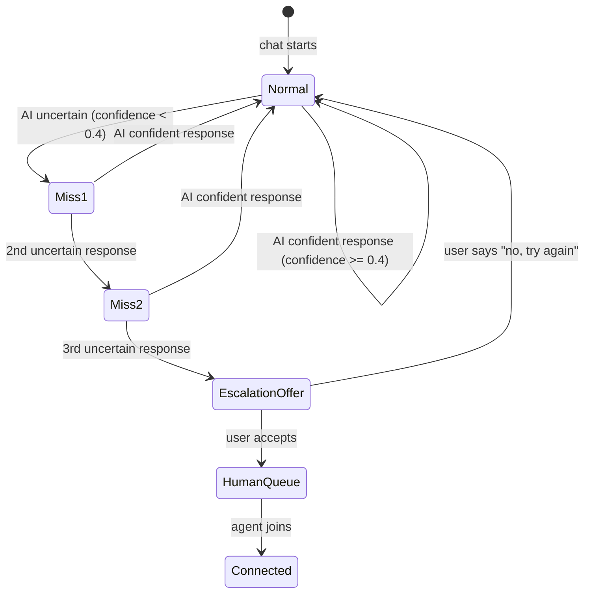

# yaemartOS AI 客服聊天界面设计

> 落地切片：S3 W34-W35（AI Chat + 工单）  
> 对标：Intercom Messenger（首屏引导）+ ChatGPT（流式回复）+ Apple Support Chat（简洁友好）  
> 关联审计：P0-4（Capability Discovery）/ M-03（命中率 ≥ 65%）

---

## 1. 首屏快捷按钮区（Capability Discovery）

### 1.1 桌面端布局

```
┌─────────────────────────────────────────────────────────────────┐
│  support.homtone.com                          [EN ▾] [Sign In] │
├─────────────────────────────────────────────────────────────────┤
│                                                                  │
│           ┌───────────────────────────────────┐                 │
│           │  🤖  Hi! I'm Homtone Support.     │                 │
│           │                                    │                 │
│           │  I can help you with product       │                 │
│           │  questions, warranty, orders,       │                 │
│           │  and more.                         │                 │
│           │                                    │                 │
│           │  How can I help you today?         │                 │
│           └───────────────────────────────────┘                 │
│                                                                  │
│   ┌──────────────┐  ┌──────────────┐  ┌──────────────┐         │
│   │ 📦            │  │ 🛡️            │  │ 📖            │         │
│   │ Track My      │  │ Register      │  │ Find User     │         │
│   │ Order         │  │ Warranty      │  │ Manual        │         │
│   │               │  │               │  │               │         │
│   │ Check status  │  │ Protect your  │  │ Download PDF  │         │
│   │ with order ID │  │ product now   │  │ in any lang   │         │
│   └──────────────┘  └──────────────┘  └──────────────┘         │
│                                                                  │
│   ┌──────────────┐                                              │
│   │ 💬            │                                              │
│   │ Ask a         │                                              │
│   │ Question      │                                              │
│   │               │                                              │
│   │ Product usage │                                              │
│   │ & support     │                                              │
│   └──────────────┘                                              │
│                                                                  │
│  ┌──────────────────────────────────────────────────────┐       │
│  │ Type a message...                          [Send ➤] │       │
│  └──────────────────────────────────────────────────────┘       │
│                                                                  │
└─────────────────────────────────────────────────────────────────┘
```

### 1.2 快捷卡片配置

| 卡片              | 图标            | 标题              | 副标题                       | 点击预设消息                                 |
| ----------------- | --------------- | ----------------- | ---------------------------- | -------------------------------------------- |
| Track My Order    | `Package`       | Track My Order    | Check status with order ID   | "I want to check my order status"            |
| Register Warranty | `ShieldCheck`   | Register Warranty | Protect your product now     | "I want to register my product for warranty" |
| Find User Manual  | `BookOpen`      | Find User Manual  | Download PDF in any language | "I need the user manual for my product"      |
| Ask a Question    | `MessageCircle` | Ask a Question    | Product usage & support      | (free-text mode)                             |

### 1.3 快捷卡片组件

```tsx
function QuickActionCard({ icon: Icon, title, subtitle, onClick }: QuickActionProps) {
  return (
    <button
      onClick={onClick}
      className="flex flex-col gap-2 p-4 rounded-lg border border-zinc-200
                 hover:border-[rgb(var(--brand-primary))] hover:bg-[rgb(var(--brand-bg))]
                 transition-colors text-left w-full"
    >
      <Icon className="w-5 h-5 text-[rgb(var(--brand-primary))]" />
      <span className="text-sm font-medium text-zinc-900">{title}</span>
      <span className="text-xs text-zinc-500">{subtitle}</span>
    </button>
  );
}
```

---

## 2. AI 自我介绍能力清单

### 2.1 System Welcome Message（Chat 加载时自动展示）

```
┌─ AI Message ────────────────────────────────────────────────┐
│  🤖  Homtone Support                                        │
│                                                              │
│  Hi! I'm your AI assistant for Homtone products.            │
│                                                              │
│  ✅ I can help you with:                                     │
│  • Check order status (with your order ID)                  │
│  • Register your product for warranty                       │
│  • Find and download user manuals                           │
│  • Answer product usage questions                           │
│  • Troubleshoot common issues                               │
│  • Create a support ticket                                  │
│                                                              │
│  ❌ I cannot:                                                │
│  • Process payments or refunds (visit Amazon/Walmart)       │
│  • Modify existing orders (contact seller directly)         │
│  • Access your Amazon account                               │
│                                                              │
│  Just type your question or choose a quick action above!    │
└─────────────────────────────────────────────────────────────┘
```

### 2.2 "Can't Help" 边界消息模板

当用户问超出范围的事：

```
"I understand you'd like to [user_intent]. Unfortunately, I can't do that
directly. Here's what you can do:

→ For refunds: Visit your Amazon Orders page > Request Return
→ For address changes: Contact Amazon Customer Service within 30 minutes

Is there anything else I can help with?"
```

---

## 3. 消息气泡设计

### 3.1 视觉规范

```
USER MESSAGE (右对齐):
┌─────────────────────────────┐
│  I want to check my order   │  bg-brand-primary, text-white
│  status for B0C123456       │  rounded-2xl rounded-br-sm
└─────────────────────────────┘
                        10:23 AM

AI MESSAGE (左对齐):
     ┌──┐
     │🤖│  ← Avatar (24x24, brand-colored border)
     └──┘
     ┌─────────────────────────────────────────┐
     │  I'll look that up for you.             │  bg-zinc-100, text-zinc-900
     │                                          │  rounded-2xl rounded-bl-sm
     │  ┌─────────────────────────────────┐    │
     │  │ 🔍 Looking up order B0C123456...│    │  ← Tool call inline card
     │  └─────────────────────────────────┘    │
     │                                          │
     │  ┌─────────────────────────────────┐    │
     │  │ ✓ Order found                    │    │  ← Tool result card
     │  │   Status: Shipped                │    │
     │  │   Carrier: UPS                   │    │
     │  │   ETA: Apr 25, 2026              │    │
     │  │   Tracking: 1Z999AA10123456784   │    │
     │  └─────────────────────────────────┘    │
     │                                          │
     │  Your order is on its way! It should    │
     │  arrive by April 25th.                  │
     └─────────────────────────────────────────┘
                                         10:23 AM
```

### 3.2 流式打字机效果

```tsx
function useStreamingText(stream: ReadableStream<string>) {
  const [text, setText] = useState('');
  const [isStreaming, setIsStreaming] = useState(true);

  useEffect(() => {
    const reader = stream.getReader();
    const decoder = new TextDecoder();

    async function read() {
      while (true) {
        const { done, value } = await reader.read();
        if (done) {
          setIsStreaming(false);
          break;
        }
        setText((prev) => prev + decoder.decode(value));
      }
    }
    read();
    return () => reader.cancel();
  }, [stream]);

  return { text, isStreaming };
}

function TypingIndicator() {
  return (
    <div className="flex items-center gap-1 px-3 py-2" aria-label="AI is typing">
      <span className="w-2 h-2 bg-zinc-400 rounded-full animate-bounce [animation-delay:0ms]" />
      <span className="w-2 h-2 bg-zinc-400 rounded-full animate-bounce [animation-delay:150ms]" />
      <span className="w-2 h-2 bg-zinc-400 rounded-full animate-bounce [animation-delay:300ms]" />
    </div>
  );
}
```

### 3.3 工具调用 Inline 卡片

```tsx
function ToolCallCard({ toolName, status, result }: ToolCallProps) {
  const icons: Record<string, ReactNode> = {
    'order.lookup': <Search className="w-4 h-4" />,
    'rag.product_knowledge': <BookOpen className="w-4 h-4" />,
    'warranty.check': <ShieldCheck className="w-4 h-4" />,
  };

  return (
    <div className="border rounded-lg p-3 my-2 bg-white">
      <div className="flex items-center gap-2 text-sm">
        {icons[toolName] ?? <Zap className="w-4 h-4" />}
        <span className="text-zinc-600">
          {status === 'loading' ? `Looking up...` : `Found result`}
        </span>
        {status === 'loading' && <Loader2 className="w-3 h-3 animate-spin" />}
        {status === 'done' && <CheckCircle2 className="w-3 h-3 text-green-500" />}
      </div>
      {result && <div className="mt-2 text-sm bg-zinc-50 rounded p-2">{result}</div>}
    </div>
  );
}
```

---

## 4. 3 次未命中转人工降级（UI 状态机）

### 4.1 状态机



### 4.2 第 1-2 次未命中 UI

```
AI: "I'm not sure I fully understand your question. Could you please clarify:
     • Are you asking about [option A]?
     • Or do you mean [option B]?
     • Something else entirely?"
```

### 4.3 第 3 次未命中 → 升级提示

```
┌───────────────────────────────────────────────────────────┐
│  🤖  It seems I'm having trouble helping with this.       │
│                                                            │
│  Would you like me to connect you with a human agent?     │
│  They can usually respond within 2 hours during           │
│  business hours (Mon-Fri, 9AM-5PM EST).                   │
│                                                            │
│  ┌─────────────────────┐  ┌─────────────────────┐        │
│  │ 👤 Yes, connect me  │  │ 🔄 No, let me try   │        │
│  │                     │  │    again             │        │
│  └─────────────────────┘  └─────────────────────┘        │
└───────────────────────────────────────────────────────────┘
```

### 4.4 工单创建确认（用户点"Yes, connect me"后）

```
┌───────────────────────────────────────────────────────────┐
│  Create Support Ticket                                     │
│  ─────────────────────                                    │
│                                                            │
│  Summary (auto-filled from chat):                         │
│  ┌─────────────────────────────────────────────────┐     │
│  │ Customer unable to find warranty registration    │     │
│  │ for model HT-6QT purchased 3 months ago         │     │
│  └─────────────────────────────────────────────────┘     │
│                                                            │
│  Your email:                                               │
│  ┌─────────────────────────────────────────────────┐     │
│  │ john@example.com                                 │     │
│  └─────────────────────────────────────────────────┘     │
│                                                            │
│  Priority:  ○ Low  ● Normal  ○ Urgent                     │
│                                                            │
│  □ Include chat transcript with ticket                     │
│                                                            │
│  [Cancel]                        [Create Ticket]           │
└───────────────────────────────────────────────────────────┘
```

---

## 5. 多语言切换

### 5.1 顶部 Locale Selector

```
┌─────────────────────────────────────────────────────────┐
│  [Homtone Logo]           [English ▾]      [Sign In]    │
│                            ┌──────────┐                  │
│                            │ English  │ ← detected       │
│                            │ Español  │                  │
│                            │ Français │                  │
│                            └──────────┘                  │
└─────────────────────────────────────────────────────────┘
```

### 5.2 输入框 Placeholder 多语言

| Locale | Placeholder              |
| ------ | ------------------------ |
| EN     | "Type a message..."      |
| ES     | "Escribe un mensaje..."  |
| FR     | "Tapez un message..."    |
| DE     | "Nachricht eingeben..."  |
| IT     | "Scrivi un messaggio..." |

### 5.3 AI 语言自动检测逻辑

```
优先级：
1. 客户首条消息语言（AI 自动检测）
2. 域名 locale（support.homtone.com/es → Spanish）
3. 浏览器 Accept-Language header
4. 默认 English

切换规则：
- 客户用西班牙语写 → AI 西班牙语回复（即使域名是 EN）
- 中途切换语言 → AI 跟随切换，不问
```

---

## 6. 登录 vs 匿名状态差异

### 6.1 登录用户首屏

```
┌──────────────────────────────────────────────────────┐
│  🤖  Hi Sarah! Welcome back.                         │
│                                                       │
│  Here's what I can see for your account:             │
│  • 2 registered products                             │
│  • 1 open support ticket (#T-2341)                   │
│                                                       │
│  ┌──────────┐ ┌──────────┐ ┌──────────┐ ┌────────┐ │
│  │My Products│ │My Tickets│ │ Warranty │ │  Ask   │ │
│  └──────────┘ └──────────┘ └──────────┘ └────────┘ │
└──────────────────────────────────────────────────────┘
```

### 6.2 匿名访客首屏

```
┌──────────────────────────────────────────────────────┐
│  🤖  Hi! I'm Homtone Support.                        │
│                                                       │
│  ┌──────────┐ ┌──────────┐ ┌──────────┐ ┌────────┐ │
│  │Track Order│ │ Warranty │ │  Manual  │ │  Ask   │ │
│  └──────────┘ └──────────┘ └──────────┘ └────────┘ │
│                                                       │
│  ┌──────────────────────────────────────────────┐   │
│  │ 🔑 Sign in for personalized support →        │   │
│  └──────────────────────────────────────────────┘   │
└──────────────────────────────────────────────────────┘
```

---

## 7. 手机端响应式（必做）

### 7.1 全屏 Chat 布局

```
┌───────────────────────┐
│ ← Homtone Support     │  ← 品牌色 header
├───────────────────────┤
│                       │
│  [AI Messages...]     │  ← flex-1 overflow-y-auto
│                       │
│  [Tool call cards]    │
│                       │
│  [User messages]      │
│                       │
├───────────────────────┤
│ Quick Actions (scroll)│  ← 水平滑动快捷卡片
│ [📦][🛡️][📖][💬]     │
├───────────────────────┤
│ [Message input    ][➤]│  ← 固定底部，拇指可达
└───────────────────────┘
```

### 7.2 关键响应式断点

| 断点                | 布局变化                           |
| ------------------- | ---------------------------------- |
| < 640px (mobile)    | 快捷卡片改为水平滚动条；输入框满宽 |
| 640-1024px (tablet) | 2×2 网格卡片                       |
| > 1024px (desktop)  | 居中容器 max-w-2xl + 卡片 4 列     |

### 7.3 手机端交互注意

| 注意点   | 处理                                          |
| -------- | --------------------------------------------- |
| 键盘弹起 | 聊天区域自动滚到底部；输入框保持可见          |
| 拇指热区 | 发送按钮高度 ≥ 44px；距底边 ≥ safe-area-inset |
| 长消息   | AI 回复超过 3 屏时折叠为摘要 + "Read more"    |
| 网络断开 | 消息气泡标记"⚠️ Sending..." 队列重试          |

---

## 8. Don'ts（反面例子）

| ❌ 不要做                                         | ✅ 替代做法                                      | 原因                                     |
| ------------------------------------------------- | ------------------------------------------------ | ---------------------------------------- |
| AI 自动开始对话"How can I help?" without 快捷按钮 | 静态欢迎 + 4 张快捷卡片                          | 空白输入框吓退普通客户，快捷按钮降低门槛 |
| 隐藏"AI 不能做什么"                               | 主动声明能力边界                                 | 设定预期 → 命中率提升 → 减少 frustration |
| AI 加载时只显示 "..."                             | 带动画的 3 点 TypingIndicator + 工具调用具名卡片 | 让用户知道 AI 在"做事"而不是卡死         |

---

## 9. shadcn/ui 组件清单（本页面）

`Button` / `Card` / `Avatar` / `Badge` / `Dialog` / `Sheet`（移动端侧滑）/ `ScrollArea` / `Input` / `Select` / `Separator` / `Toast`

---

## 10. 切片落地计划

| 内容                           | 切片 | 周次 | 优先级 |
| ------------------------------ | ---- | ---- | ------ |
| 快捷按钮 + AI 欢迎消息         | S3   | W34  | P0     |
| 流式消息气泡 + TypingIndicator | S3   | W34  | P0     |
| 工具调用 Inline 卡片           | S3   | W34  | P0     |
| 3 次未命中 → 转人工 + 工单创建 | S3   | W35  | P0     |
| 多语言切换 + AI 语言检测       | S3   | W35  | P1     |
| 登录 vs 匿名差异化首屏         | S3   | W35  | P1     |
| 手机端响应式                   | S3   | W36  | P1     |
